# MZM 偏压控制器技术素材文档

## 1. MZM 物理基础与调制理论

### 1.1 MZM 传递函数

#### 双光束干涉模型

Mach-Zehnder 调制器（MZM）的基本结构是一个 1×2 分束器 + 两条相位调制臂 + 一个 2×1 合束器。设输入光场为 $E_{\mathrm{in}}$，两臂分束比为 50:50，则两臂传播后的光场分别为：

$$E_1 = \frac{E_{\mathrm{in}}}{\sqrt{2}} \, e^{j\phi_1}, \qquad
  E_2 = \frac{E_{\mathrm{in}}}{\sqrt{2}} \, e^{j\phi_2}$$

合束后的输出光场：

$$E_{\mathrm{out}} = \frac{1}{\sqrt{2}}(E_1 + E_2)
  = \frac{E_{\mathrm{in}}}{2} \left( e^{j\phi_1} + e^{j\phi_2} \right)$$

定义差分相位 $\phi \triangleq \phi_1 - \phi_2$，输出光功率为：

$$P_{\mathrm{out}} = |E_{\mathrm{out}}|^2
  = \frac{P_{\mathrm{in}}}{2} \left(1 + \cos\phi \right)$$

#### 本系统的相位约定

本系统中 MZM 的相位零点定义在**消光点**（extinction，最小输出），对应 $\phi = \pi$。为使公式更直观，我们定义**偏压相位**为相对于消光点的偏移：

$$\varphi \triangleq \pi - \phi$$

在此约定下，传递函数变为：

$$\boxed{P_{\mathrm{out}}(\varphi) = \frac{P_{\mathrm{in}}}{2}\left[1 - \cos\varphi\right] = P_{\mathrm{in}} \sin^2\!\left(\frac{\varphi}{2}\right)}$$

关键工作点：

| 工作点 | $\varphi$ | $P_{\mathrm{out}}/P_{\mathrm{in}}$ | 特性 |
|--------|-----------|-------------------------------------|------|
| MIN（消光） | $0$ | $0$ | 最小输出 |
| QUAD（正交） | $\pi/2$ | $1/2$ | 最大线性斜率 |
| MAX（峰值） | $\pi$ | $1$ | 最大输出 |

#### 电压-相位关系

电光调制通过铌酸锂 Pockels 效应产生相位变化：

$$\varphi = \pi \frac{V_{\mathrm{bias}}}{V_\pi}$$

其中 $V_\pi$ 是半波电压，即产生 $\pi$ 相移所需的电压。因此传递函数也可写成电压形式：

$$P_{\mathrm{out}}(V) = P_{\mathrm{in}} \sin^2\!\left(\frac{\pi V}{2 V_\pi}\right)$$

**实测值**：本系统 MZM 的 $V_\pi = 5.450 \pm 0.065$ V（2026-04-13 标定），对应 $V_{\mathrm{null}} = -2.81$ V，$V_{\mathrm{peak}} = 2.64$ V。

---

### 1.2 导频抖动与 Jacobi-Anger 展开

#### 导频叠加

在偏压 $V_{\mathrm{bias}}$ 上叠加一个小幅正弦导频信号：

$$V(t) = V_{\mathrm{bias}} + A_p \sin(\omega_p t)$$

其中 $A_p$ 为导频峰值电压，$\omega_p = 2\pi f_p$，$f_p = 1$ kHz。对应的瞬时相位为：

$$\varphi(t) = \varphi_0 + m \sin(\omega_p t)$$

其中 $\varphi_0 = \pi V_{\mathrm{bias}} / V_\pi$ 是静态偏压相位，$m = \pi A_p / V_\pi$ 是**调制指数**。

**实测值**：$A_p = 0.05$ V，$V_\pi = 5.45$ V，故 $m = \pi \times 0.05 / 5.45 = 0.0288$（深度小信号区）。

#### Jacobi-Anger 展开

将 $\cos\varphi(t)$ 展开。利用加法定理：

$$\cos(\varphi_0 + m\sin\omega_p t) = \cos\varphi_0 \cdot \cos(m\sin\omega_p t) - \sin\varphi_0 \cdot \sin(m\sin\omega_p t)$$

其中 $\cos(m\sin\theta)$ 和 $\sin(m\sin\theta)$ 的 Bessel 函数展开为（Jacobi-Anger 恒等式）：

$$\cos(m\sin\theta) = J_0(m) + 2\sum_{k=1}^{\infty} J_{2k}(m)\cos(2k\theta)$$

$$\sin(m\sin\theta) = 2\sum_{k=0}^{\infty} J_{2k+1}(m)\sin\!\big((2k+1)\theta\big)$$

代入并整理各频率分量：

$$\cos(\varphi_0 + m\sin\omega_p t) = \underbrace{J_0(m)\cos\varphi_0}_{\text{DC}}
- \underbrace{2J_1(m)\sin\varphi_0 \cdot \sin(\omega_p t)}_{\text{基频 } f_p}
+ \underbrace{2J_2(m)\cos\varphi_0 \cdot \cos(2\omega_p t)}_{\text{二次谐波 } 2f_p}
- \cdots$$

#### 光电检测后的谐波信号

光电探测器输出电压正比于光功率 $P_{\mathrm{out}} = P_{\mathrm{in}}[1 - \cos\varphi(t)]/2$。经 TIA 放大后：

$$v_{\mathrm{PD}}(t) = R \cdot \eta \cdot P_{\mathrm{out}}(t)$$

其中 $R$ 为 TIA 跨阻，$\eta$ 为光电探测器响应度。取出各频率分量（省去公共系数 $R\eta P_{\mathrm{in}}/2$）：

**基频分量（$f_p = 1$ kHz）**：

$$\boxed{H_1 = R\eta P_{\mathrm{in}} \cdot J_1(m) \cdot \sin\varphi_0 \cdot \sin(\omega_p t)}$$

**二次谐波分量（$2f_p = 2$ kHz）**：

$$\boxed{H_2 = -R\eta P_{\mathrm{in}} \cdot J_2(m) \cdot \cos\varphi_0 \cdot \cos(2\omega_p t)}$$

#### 各工作点处的谐波行为

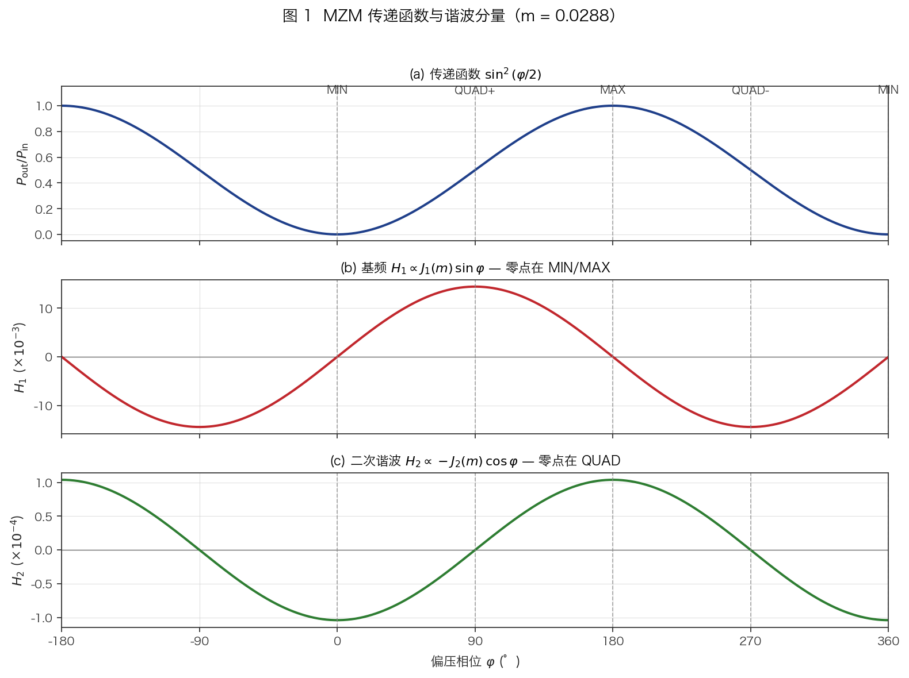

*图 1：$P_{\mathrm{out}}/P_{\mathrm{in}} = \sin^2(\varphi/2)$、$H_1 \propto J_1(m)\sin\varphi$、$H_2 \propto -J_2(m)\cos\varphi$ 的理论曲线。竖虚线标出 MIN / QUAD / MAX 三个工作点；可见 $H_1$ 在 MIN/MAX 过零，$H_2$ 在 QUAD 过零，二者互补。*

| 工作点 | $\varphi_0$ | $\sin\varphi_0$ | $\cos\varphi_0$ | $H_1$ 幅度 | $H_2$ 幅度 |
|--------|-------------|-----------------|-----------------|-----------|-----------|
| MIN | $0$ | $0$ | $1$ | **零** | **最大** |
| QUAD | $\pi/2$ | $1$ | $0$ | **最大** | **零** |
| MAX | $\pi$ | $0$ | $-1$ | **零** | **最大**（反相） |

关键物理意义：
- **$H_1 \propto \sin\varphi_0$**：传递函数的一阶导数鉴频信号。零交叉出现在 MIN 和 MAX。
- **$H_2 \propto -\cos\varphi_0$**：二阶导数信号。零交叉出现在 QUAD。
- 同时利用 $H_1$ 和 $H_2$，可以在**任意工作点**提取相位信息，而非仅限于 QUAD。

---

### 1.3 贝塞尔函数特性

#### 级数定义

第一类 Bessel 函数 $J_n(x)$ 的幂级数展开：

$$J_n(x) = \sum_{k=0}^{\infty} \frac{(-1)^k}{k!\,(k+n)!} \left(\frac{x}{2}\right)^{2k+n}$$

对于 $n=1$ 和 $n=2$：

$$J_1(x) = \frac{x}{2} - \frac{x^3}{16} + \frac{x^5}{384} - \cdots
= \frac{x}{2} \sum_{k=0}^{\infty} \frac{(-x^2/4)^k}{k!\,(k+1)!}$$

$$J_2(x) = \frac{x^2}{8} - \frac{x^4}{96} + \frac{x^6}{3072} - \cdots
= \frac{x^2}{8} \sum_{k=0}^{\infty} \frac{(-x^2/4)^k}{k!\,(k+2)!}$$

固件实现（`ctrl_modulator_mzm.c`）使用此级数展开，最多迭代 20 次，绝对残差 $<10^{-8}$ 时截断。$J_1$ 保持奇对称性 $J_1(-x) = -J_1(x)$，$J_2$ 保持偶对称性 $J_2(-x) = J_2(x)$。

#### 小调制指数近似

当 $m \ll 1$ 时（本系统 $m = 0.0288$），保留首项即可：

$$J_1(m) \approx \frac{m}{2} = 0.0144, \qquad J_2(m) \approx \frac{m^2}{8} = 1.04 \times 10^{-4}$$

各次谐波的绝对幅度之比：

$$\frac{|H_2|_{\max}}{|H_1|_{\max}} = \frac{J_2(m)}{J_1(m)} \approx \frac{m}{4} = 0.0072$$

即 $H_2$ 比 $H_1$ 弱约 **140 倍**（43 dB）。这是 QUAD 附近 $H_2 \to 0$ 时观测器噪声主导的根本原因。

#### 贝塞尔补偿原理

当导频幅度从标定时的 $A_p^{\mathrm{cal}}$ 变化到 $A_p^{\mathrm{now}}$ 时，调制指数从 $m_{\mathrm{cal}}$ 变化到 $m_{\mathrm{now}}$，谐波幅度的比例变化为：

$$\frac{H_n^{\mathrm{now}}}{H_n^{\mathrm{cal}}} = \frac{J_n(m_{\mathrm{now}})}{J_n(m_{\mathrm{cal}})}$$

固件通过 `scale_axis_for_pilot()` 函数对仿射矩阵的每行分别乘以 $J_1$ 比和 $J_2$ 比，从而在逆变换后消除导频幅度变化的影响。

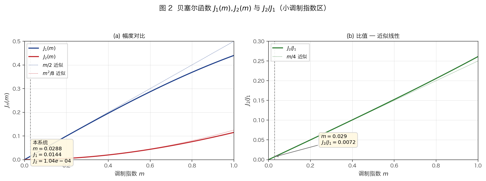

*图 2：$J_1(m)$、$J_2(m)$ 及比值 $J_2/J_1 \approx m/4$ 在 $m \in [0, 1]$ 区间的变化。竖虚线标出本系统的标定值 $m = 0.0288$，对应 $J_1 \approx 0.0145$、$J_2 \approx 1.05\times 10^{-4}$。可见 $J_2$ 按 $m^2$ 上升，对导频幅度远比 $J_1$ 敏感，这是 $H_1$/$H_2$ 需要独立补偿的根本原因。*

**表：不同调制指数下的 Bessel 函数值**

| $m$ | $J_1(m)$ | $J_2(m)$ | $J_1/J_1(0.029)$ | $J_2/J_2(0.029)$ |
|-----|----------|----------|-------------------|-------------------|
| 0.015 | 0.00750 | $2.81 \times 10^{-5}$ | 0.52 | 0.27 |
| 0.029 | 0.01448 | $1.05 \times 10^{-4}$ | 1.00 | 1.00 |
| 0.058 | 0.02893 | $4.18 \times 10^{-4}$ | 2.00 | 3.99 |
| 0.100 | 0.04994 | $1.25 \times 10^{-3}$ | 3.45 | 11.9 |
| 0.500 | 0.2423  | $3.06 \times 10^{-2}$ | 16.7 | 292 |

注意 $J_2$ 对 $m$ 的变化远比 $J_1$ 敏感（$J_2 \sim m^2$ vs $J_1 \sim m$），因此 $H_1$ 和 $H_2$ 两行必须**独立补偿**，不能用单一缩放因子。

---

### 1.4 硬件相位延迟与 H2 Q 分量选择

#### 问题描述

光电检测链路（PD → TIA → ADC）在信号频率处引入相位延迟。设 $\tau_d$ 为群延迟，则 Goertzel 算法检测到的信号相对于 DAC 发出的导频有一个相位偏移：

$$\Delta\theta_n = 2\pi n f_p \tau_d$$

其中 $n$ 为谐波阶数。因此：
- $H_1$（$f_p = 1\ \text{kHz}$ ）的相位偏移：$\Delta\theta_1 \approx 41^{\circ}$
- $H_2$（$2f_p = 2\ \text{kHz}$ ）的相位偏移：$\Delta\theta_2 \approx 82^{\circ}$

#### Goertzel I/Q 分量分析

Goertzel 算法输出复数 $H_n = |H_n| e^{j\theta_n}$，可分解为 I（同相）和 Q（正交）分量：

$$I_n = |H_n| \cos\theta_n, \qquad Q_n = |H_n| \sin\theta_n$$

考虑 82° 的 H2 相位偏移后：

- **I 分量**（$\cos$）：$|H_2| \cos(82^{\circ}) = 0.139 \cdot |H_2|$
- **Q 分量**（$\sin$）：$|H_2| \sin(82^{\circ}) = 0.990 \cdot |H_2|$

Q 分量携带了约 **7.1 倍** 于 I 分量的信号能量。

#### 实测验证

Pass 2 标定扫描在 NULL 点（$\varphi = 0$，$H_2$ 幅度最大）处的测量值：

| 分量 | 公式 | 典型值 |
|------|------|--------|
| $h_{2,I}$ = `h2_mag × cos(h2_phase)` | I 分量 | $\approx -0.25$ mV |
| $h_{2,Q}$ = `h2_mag × sin(h2_phase)` | Q 分量 | $\approx -1.7$ mV |
| 比值 $Q/I$ | | $\approx 6.8$ |

#### 对仿射矩阵条件数的影响

如果 H2 误用 I 分量（$\cos$），则 H2 行的有效幅度仅为正确值的 $1/7$，导致仿射矩阵 $M$ 的 H2 行接近零行，行列式 $|\det M| \to 0$，矩阵近乎奇异。仿射逆变换中 $y_{\mathrm{meas}}$ 的噪声被放大约 $7^2 \approx 50$ 倍（条件数的平方），在 QUAD 处（$H_2 \to 0$）彻底淹没相位信号。

#### 设计规则

> **H2 信号投影必须使用 Q 分量**：`h2s = h2_mag × sin(h2_phase)`
>
> 这一约定必须在标定扫描（Pass 2 数据采集）和运行时控制（`mzm_get_state_vector`）中**保持一致**。不一致将导致仿射模型失效。

H1 同理使用 I 分量 `h1s = h1_mag × cos(h1_phase)`，因为 H1 的相位偏移仅 41°，$\cos(41°) = 0.755$ 仍为主导分量。

---

## 2. 数字信号处理链路

### 2.1 Goertzel 算法推导

#### DFT 单频点提取

离散 Fourier 变换（DFT）将 $N$ 点时域序列 $x[n]$ 变换到频域：

$$X[k] = \sum_{n=0}^{N-1} x[n] \, e^{-j2\pi kn/N}, \quad k = 0, 1, \ldots, N-1$$

本系统只需提取两个频率点（$f_p = 1$ kHz 和 $2f_p = 2$ kHz），不需要完整 $N$ 点 FFT。Goertzel 算法高效计算单个频率 bin $X[k]$，复杂度为 $O(N)$，远优于 FFT 的 $O(N\log N)$（当提取 bin 数远小于 $\log N$ 时）。

#### 频率 bin 索引

对于采样率 $f_s = 64$ kSPS，block 大小 $N = 1280$，目标频率 $f_{\mathrm{target}}$，对应的 DFT bin 索引为：

$$k = \frac{N \cdot f_{\mathrm{target}}}{f_s}$$

本系统的两个 Goertzel 检测器：

| 检测器 | $f_{\mathrm{target}}$ | $k = N f_{\mathrm{target}} / f_s$ | 说明 |
|--------|----------------------|-----------------------------------|------|
| H1 | 1000 Hz | $1280 \times 1000 / 64000 = 20$ | 基频 |
| H2 | 2000 Hz | $1280 \times 2000 / 64000 = 40$ | 二次谐波 |

$k$ 为精确整数，保证频率 bin 中心恰好落在目标频率上（见 §2.2 关于频谱泄漏的讨论）。

#### 二阶 IIR 递推推导

Goertzel 算法的核心思想是将 $X[k]$ 的计算重新组织为一个二阶 IIR 滤波器的递推过程。

定义归一化角频率：

$$\omega_k = \frac{2\pi k}{N}$$

以及反馈系数：

$$c = 2\cos\omega_k$$

**递推阶段**（对每个输入样本 $x[n]$）：

$$s[n] = x[n] + c \cdot s[n-1] - s[n-2]$$

初始条件 $s[-1] = s[-2] = 0$。

这是一个二阶 IIR 滤波器，每个样本仅需 **1 次乘法 + 2 次加法**，无需复数运算。

**终止阶段**（$N$ 个样本处理完毕后）：

$$X[k] = s[N-1] - s[N-2] \cdot e^{-j\omega_k}$$

分离实部和虚部：

$$\mathrm{Re}\{X[k]\} = s[N-1] - s[N-2] \cdot \cos\omega_k$$
$$\mathrm{Im}\{X[k]\} = s[N-2] \cdot \sin\omega_k$$

#### 等价性证明

将递推关系展开。$s[n]$ 的 z 变换传递函数为：

$$H(z) = \frac{1}{1 - c\,z^{-1} + z^{-2}} = \frac{1}{(1 - e^{j\omega_k}z^{-1})(1 - e^{-j\omega_k}z^{-1})}$$

这是一个谐振于 $\pm\omega_k$ 的全极点滤波器。终止阶段等价于乘以零点因子 $(1 - e^{-j\omega_k}z^{-1})$，只保留 $e^{+j\omega_k}$ 处的极点贡献，从而提取出 $X[k]$。

数学上可直接验证：将 $s[n]$ 展开为卷积形式后代入终止公式，恰好得到 DFT 定义中的求和式 $\sum_{n=0}^{N-1} x[n] e^{-j\omega_k n}$。

#### 幅度/相位提取与归一化

固件从 Goertzel 输出中提取 I/Q 分量，并归一化到正弦波幅度（`dsp_goertzel.c` L39-52）：

$$I_k = \frac{2}{N} \cdot \mathrm{Re}\{X[k]\}, \qquad Q_k = \frac{2}{N} \cdot \mathrm{Im}\{X[k]\}$$

归一化因子 $2/N$ 使得：若输入为纯正弦 $x[n] = A\sin(2\pi f_{\mathrm{target}} \cdot n/f_s + \phi)$，则：

$$\text{magnitude} = \sqrt{I_k^2 + Q_k^2} = A$$
$$\text{phase} = \arctan(Q_k / I_k) = \phi'$$

其中 $\phi'$ 为正弦波相对于 DFT 窗口起点的相位（与 $\phi$ 差一个已知的参考相位偏移）。

#### 计算量对比

| 算法 | 操作 | 单频点 | 两频点 |
|------|------|--------|--------|
| DFT 暴力法 | $N$ 次复数乘加 / bin | $2N = 2560$ 实数乘法 | 5120 |
| FFT (radix-2) | $(N/2)\log_2 N$ 蝶形 | 全部计算 ≈ 6964 | 同上 |
| Goertzel | $N$ 实数乘加 + 4 次终止 | $1280 + 4 = 1284$ | 2568 |

Goertzel 在仅需 1–2 个 bin 时比 FFT 节省约 **63%** 的乘法运算，且不需要 $N$ 点复数缓冲区（仅用 2 个状态变量 $s_1, s_2$），在嵌入式系统（STM32H523，FPv5-SP FPU）上具有显著优势。

#### 固件实现结构

```c
typedef struct {
    float coeff;      // 2·cos(2πk/N)，递推系数
    float cos_term;   // cos(2πk/N)，终止用
    float sin_term;   // sin(2πk/N)，终止用
    float s1, s2;     // IIR 延迟元素
    uint32_t count;   // 当前块内样本计数
    uint32_t block_size;  // N
} goertzel_state_t;

// 递推：每个 ADC 样本调用一次
void goertzel_process_sample(goertzel_state_t *g, float sample) {
    float s0 = sample + g->coeff * g->s1 - g->s2;
    g->s2 = g->s1;
    g->s1 = s0;
    g->count++;
}
```

注意 `goertzel_process_sample` 在 ADC DRDY 中断（64 kSPS）中被调用，因此单次执行必须在 $1/64000 \approx 15.6\ \mu s$ 内完成——实测 Cortex-M33 @ 250 MHz 上仅需 ~50 ns（3 条 FPU 指令）。

---

### 2.2 相干积分与频谱泄漏抑制

#### 整数周期条件

DFT 频谱泄漏的本质原因是：当采样窗口 $T_w = N / f_s$ 不包含目标频率的整数个周期时，目标频率不落在任何 DFT bin 的中心上，信号能量被"泄漏"到相邻 bin。

对于导频频率 $f_p$ 和 Goertzel 块大小 $N$，不发生频谱泄漏的**充要条件**是：

$$k = \frac{N \cdot f_p}{f_s} \in \mathbb{Z}$$

等价地：

$$T_w = \frac{N}{f_s} = \frac{k}{f_p} \quad (\text{窗口包含恰好 } k \text{ 个完整周期})$$

本系统的参数选取满足此条件：

$$N = 1280, \quad f_s = 64000\ \text{Hz}, \quad f_p = 1000\ \text{Hz}$$

$$T_w = \frac{1280}{64000} = 20\ \text{ms}$$

$$k_1 = \frac{1280 \times 1000}{64000} = 20 \quad \checkmark \quad (\text{恰好 20 个 } f_p \text{ 周期})$$

$$k_2 = \frac{1280 \times 2000}{64000} = 40 \quad \checkmark \quad (\text{恰好 40 个 } 2f_p \text{ 周期})$$

此条件在系统参数定义中被强制保证（`dsp_types.h`）：

```c
#define DSP_PILOT_PERIOD_SAMPLES     64      // fs / fp = 64000/1000
#define DSP_GOERTZEL_BLOCK_CYCLES    20      // 20 个完整周期
#define DSP_GOERTZEL_BLOCK_SIZE      (64 * 20)  // = 1280
```

通过将 $N$ 定义为**周期样本数 × 周期数**的形式，从结构上排除了非整数周期的可能性。

#### 频谱泄漏的数学描述

当目标频率偏离 bin 中心 $\Delta f$ 时，矩形窗的频域响应（sinc 函数）决定了泄漏程度。对于 bin 索引 $k$ 处的 DFT 值，若实际信号频率对应的 bin 索引为 $k_0$（可能非整数），则：

$$|X[k]| \propto \left| \frac{\sin\pi(k_0 - k)}{\pi(k_0 - k)} \right| = |\mathrm{sinc}(k_0 - k)|$$

当 $k_0 = k$（整数 bin，本系统情况）时，$\mathrm{sinc}(0) = 1$，全部能量集中在目标 bin，泄漏为零。

当 $k_0$ 偏离整数 0.5 bin 时（最坏情况），峰值衰减约 $3.92$ dB，且旁瓣最高为 $-13.3$ dB——对弱信号 $H_2$（已比 $H_1$ 弱 43 dB）来说，这将带来不可接受的干扰。

因此，**整数周期条件不是优化手段，而是系统正确工作的必要条件**。

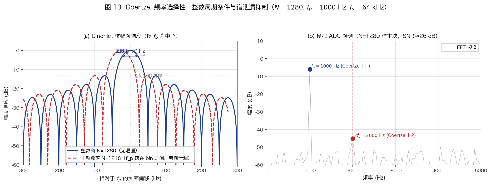

*图 13：(a) Goertzel 等效带通滤波器的 Dirichlet 核响应（以 $f_p$ 为中心）。蓝色为整数窗 N=1280（精确 20 个周期）：主瓣宽 100 Hz，旁瓣最高 −13.3 dB，目标频率处增益为 0 dB。红色虚线为非整数窗 N=1248（19.5 个周期）：$f_p$ 落在两 bin 之间，导致频谱泄漏，有效信号幅度下降约 4 dB。(b) 模拟 ADC 频谱（一个 1280 点块），蓝/红竖线标出 Goertzel 提取的 $f_p = 1000$ Hz (H1) 和 $2f_p = 2000$ Hz (H2) 两个窄带 bin，其余频率的噪声能量不进入控制环路。*

#### 相干积分的 SNR 增益

假设信号幅度为常数 $A$，噪声为零均值高斯白噪声 $\sigma_n$。Goertzel 输出的 SNR 为：

$$\mathrm{SNR}_{\mathrm{Goertzel}} = \frac{A^2}{2\sigma_n^2 / N} = \frac{N \cdot A^2}{2\sigma_n^2}$$

即 SNR 正比于 $N$（积分样本数），或等价地，Goertzel 幅度估计的标准差 $\sigma_{\hat{A}} \propto 1/\sqrt{N}$。

从 $N = 64$（1 个周期）增加到 $N = 1280$（20 个周期），SNR 改善：

$$\Delta\mathrm{SNR} = 10\log_{10}\frac{1280}{64} = 10\log_{10}(20) = 13.0\ \text{dB}$$

这对于 $H_2$ 信号（比 $H_1$ 弱 43 dB）至关重要。

#### DC 分量抑制

由整数周期条件，DC 信号（$k=0$）与目标 bin（$k=20$ 或 $k=40$）之间的隔离度为：

$$\mathrm{sinc}(20) = 0$$

即 Goertzel 检测器对 DC 偏置**完全不敏感**（无频谱泄漏时 sinc 函数在所有非零整数点为零）。这允许 TIA 输出的 DC 偏移在较大范围内变化而不影响谐波提取精度。

单元测试 `test_dc_signal()` 验证了此特性：1280 个 DC=1.0 样本输入 1 kHz Goertzel，输出幅度 $< 0.01$（容差范围内为零）。

---

### 2.3 导频 LUT 生成

#### 查找表设计

导频信号由 DAC 同步输出，需在每个 ADC 采样间隔（$T_s = 1/64000 \approx 15.6\ \mu s$）内产生一个正弦样本。

查找表（LUT）大小为一个完整导频周期所包含的 ADC 样本数：

$$L = \frac{f_s}{f_p} = \frac{64000}{1000} = 64$$

LUT 在初始化时预计算（`dsp_pilot_gen.c` L25-28）：

$$\mathrm{lut}[i] = \sin\!\left(\frac{2\pi i}{L}\right), \quad i = 0, 1, \ldots, L-1$$

运行时输出：

$$p[n] = A_p \cdot \mathrm{lut}[\,n \bmod L\,]$$

其中 $A_p$ 为导频峰值幅度（本系统 $A_p \approx 0.05$ V，对应 DAC 约 164 LSB）。

#### 零相位漂移证明

由于 $L = f_s / f_p$ 为精确整数（64），相位索引的循环递增 $n \bmod 64$ 在每个导频周期后精确回到 $i=0$，不存在累积相位误差。

形式证明：设第 $n$ 个样本的相位角为：

$$\theta[n] = \frac{2\pi}{L} \cdot (n \bmod L) = \frac{2\pi f_p n}{f_s} \bmod 2\pi$$

$L$ 为整数意味着相位索引在 $n = L, 2L, 3L, \ldots$ 时精确回到 0，无舍入误差。

与替代方案（浮点相位累加器 $\theta[n+1] = \theta[n] + 2\pi f_p / f_s$）相比，LUT 方法：
- 无浮点累积误差（相位累加器每步有 $\sim 2^{-24}$ 的舍入，$10^6$ 步后偏移 $\sim 0.06$ rad ≈ 3.4°）
- 每个样本仅需 1 次乘法 + 1 次查表（vs 1 次加法 + 1 次取模 + 1 次 `sinf` 调用）
- 内存开销仅 $64 \times 4 = 256$ 字节

#### DAC 输出表达式

每个 ADC DRDY 中断中，DAC 通道 A 的输出电压为：

$$V_{\mathrm{DAC}}[n] = V_{\mathrm{bias}}[n] + A_p \cdot \mathrm{lut}[\,n \bmod 64\,]$$

其中 $V_{\mathrm{bias}}[n]$ 为控制器当前偏压设定值（5 Hz 更新率），经 clamp 到 $[-10, +10]$ V 后写入 DAC8568。

经过板上减法器电路（4× 增益），实际施加在 MZM 偏压电极上的电压为：

$$V_{\mathrm{mod}}[n] = 4 \times V_{\mathrm{DAC}}[n] = 4V_{\mathrm{bias}}[n] + 4A_p \sin(2\pi f_p n / f_s)$$

#### LUT 与 Goertzel 的相位同步

导频 LUT 和 Goertzel 检测器共用同一个采样时钟（ADC DRDY），保证：

1. **频率精确匹配**：LUT 周期 $= 64$ 样本 $= f_s / f_p$，与 Goertzel 的目标频率 $f_p$ 定义一致
2. **块边界对齐**：Goertzel 块大小 $N = 1280 = 20 \times 64$，恰好包含 20 个完整 LUT 周期，保证 Goertzel 终止时 LUT 也在周期边界
3. **无采样率抖动**：ADC 使用专用 8.192 MHz HSE 晶振作为 CLKIN，分频后得到精确 64 kSPS，消除采样率不确定性

这三个条件共同保证了 Goertzel 检测到的相位 $\theta_n$ 是**确定性的**——仅反映光电检测链路的群延迟，不包含任何与采样时钟相关的随机成分。

---

### 2.4 多块鲁棒平均 + IQ EMA

#### 控制降采样架构

Goertzel 每 20 ms（$N = 1280$ 个样本）输出一组 $(h_1\text{-mag}, h_1\text{-phase}, h_2\text{-mag}, h_2\text{-phase})$。控制器将 $D = 10$ 个连续 Goertzel 块的结果汇聚后再执行一次 PI 更新，形成 **5 Hz 控制节拍**：

$$T_{\mathrm{ctrl}} = D \times T_{\mathrm{block}} = 10 \times 20\ \text{ms} = 200\ \text{ms}$$

每个控制周期的总积分时间为 $N \times D = 12800$ 个 ADC 样本（200 ms），等效 SNR 增益（相对单块）：

$$\Delta\mathrm{SNR}_D = 10\log_{10}(D) = 10\log_{10}(10) = 10\ \text{dB}$$

#### I/Q 分量存储

每个 Goertzel 块完成后，幅度和相位被转换为 I/Q 分量存储（`ctrl_bias.c` L218-221）：

$$I_{h1}^{(b)} = |H_1^{(b)}| \cos\theta_1^{(b)}, \quad Q_{h1}^{(b)} = |H_1^{(b)}| \sin\theta_1^{(b)}$$
$$I_{h2}^{(b)} = |H_2^{(b)}| \cos\theta_2^{(b)}, \quad Q_{h2}^{(b)} = |H_2^{(b)}| \sin\theta_2^{(b)}$$

其中 $b = 0, 1, \ldots, D-1$ 为块索引。

**为什么存储 I/Q 而不是幅度/相位？**

1. **矢量平均正确性**：幅度和相位的算术平均 $\bar{A} = \mathrm{mean}(A^{(b)})$, $\bar\theta = \mathrm{mean}(\theta^{(b)})$ 在相位绕零点（$\pm\pi$）跳变时产生错误结果。I/Q 分量的平均保持矢量含义正确。

2. **噪声等效带宽一致性**：I 和 Q 各自具有高斯分布（中心极限定理），可用标准统计方法处理。

3. **与后续 EMA 滤波的兼容性**：EMA 是线性算子，对 I/Q 分量独立操作等价于对复数信号的 EMA。

#### 鲁棒均值（Robust Mean）

10 个块的 I/Q 值通过**中值裁剪鲁棒均值**汇聚（`ctrl_bias.c` L40-73）。算法步骤：

1. **排序**：对 $D = 10$ 个值执行插入排序（$O(D^2)$，$D$ 小时高效且避免动态分配）
2. **裁剪**：去除排序后的最小值和最大值各 1 个
3. **求均值**：对剩余 $D - 2 = 8$ 个中间值取算术平均

$$\mathrm{robust\_mean}(x^{(0)}, \ldots, x^{(D-1)}) = \frac{1}{D-2} \sum_{i=1}^{D-2} x_{\mathrm{sorted}}^{(i)}$$

特殊情况处理：
- $D = 1$：直接返回
- $D = 2$：取两值平均
- $D = 3$：返回中位数
- $D = 4$：返回中间两值的平均

**鲁棒性分析**：

裁剪 min/max 后，单个异常块（如 ADC 毛刺、DAC 换步过渡）对均值的最大影响从 $1/D = 10\%$ 降低到 $\leq 1/(D-2) = 12.5\%$（已排除异常值后在正常值中的影响）。更重要的是，**离群值被完全移除**而非被平均化，避免了偏压阶跃或光功率跳变期间的瞬态污染。

此裁剪对 4 个 I/Q 通道（$I_{h1}, Q_{h1}, I_{h2}, Q_{h2}$）独立执行，每个 200 ms 控制周期执行 4 次排序（$4 \times 10 = 40$ 元素排序），计算量可忽略。

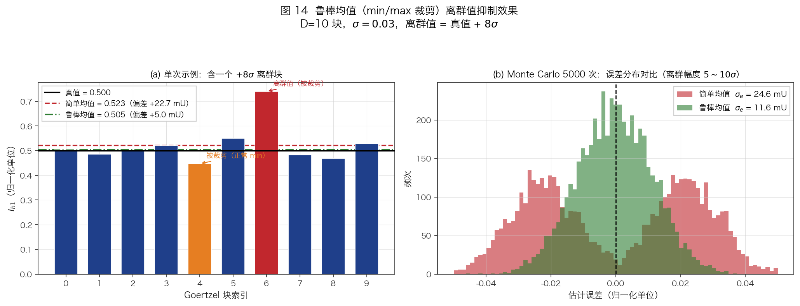

*图 14：(a) 单次示例：D=10 块的 $I_{h1}$ 值，块 6 为 $+8\sigma$ 离群脉冲（红色），块 4 为被意外裁剪的正常最小值（橙色）。黑色实线为真值，红色虚线为简单均值（偏高 22.7 mU），绿色点划线为鲁棒均值（偏高仅 5.0 mU，误差降低 ≈4.5 倍）。(b) Monte Carlo 5000 次实验（离群幅度 5～10σ，位置随机）的误差分布：鲁棒均值分布（绿）比简单均值（红）窄约 2 倍，且几乎无重尾。*

#### IQ EMA 低通滤波

鲁棒均值输出经指数移动平均（EMA）滤波，进一步平滑 5 Hz 控制速率的更新（`ctrl_bias.c` L11-15）：

$$I_{\mathrm{filt}}[n] = I_{\mathrm{filt}}[n-1] + \alpha \cdot (I_{\mathrm{robust}}[n] - I_{\mathrm{filt}}[n-1])$$
$$Q_{\mathrm{filt}}[n] = Q_{\mathrm{filt}}[n-1] + \alpha \cdot (Q_{\mathrm{robust}}[n] - Q_{\mathrm{filt}}[n-1])$$

其中 $\alpha = 0.20$。

**时间常数**：

EMA 的等效时间常数为：

$$\tau = -\frac{T_{\mathrm{ctrl}}}{\ln(1-\alpha)} = -\frac{200\ \text{ms}}{\ln(0.80)} = \frac{200\ \text{ms}}{0.2231} \approx 0.90\ \text{s}$$

**频率响应**（连续时间近似）：

EMA 等价于一阶低通滤波器，$-3$ dB 截止频率为：

$$f_{-3\mathrm{dB}} = \frac{1}{2\pi\tau} = \frac{1}{2\pi \times 0.90} \approx 0.18\ \text{Hz}$$

在 5 Hz 采样率（Nyquist 2.5 Hz）下，这意味着仅通过最低约 7% 的频率分量，对 $>0.5$ Hz 的噪声和干扰衰减 $>8$ dB。

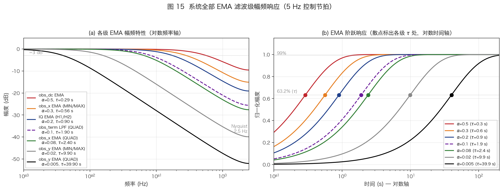

*图 15：系统中所有 7 个 EMA 滤波级（5 Hz 节拍）的特性对比。(a) Bode 幅频曲线（对数频率轴）：时间常数从 obs_dc（τ=0.29 s）到 obs_y QUAD（τ=40 s）跨越约 2.5 个数量级；各曲线在 $-3$ dB 处的截止频率即为 $1/(2\pi\tau)$。(b) 阶跃响应（对数时间轴）：散点标出各级 $\tau$ 处（63.2%），清晰展示慢速滤波器（obs_y QUAD、obs_y MIN/MAX）对稳态精度的保护作用。*

**冷启动初始化**：

首次更新时（`iq_filter_valid == false`），EMA 直接赋值为当前鲁棒均值，避免从零值缓慢攀升。后续更新切换为正常 EMA 递推。

#### 汇总后的幅度/相位重建

EMA 滤波后的 I/Q 值重建为幅度和相位（`ctrl_bias.c` L248-250, L266-268）：

$$|H_n|_{\mathrm{filt}} = \sqrt{I_{hn,\mathrm{filt}}^2 + Q_{hn,\mathrm{filt}}^2}$$
$$\theta_{n,\mathrm{filt}} = \arctan(Q_{hn,\mathrm{filt}} / I_{hn,\mathrm{filt}})$$

这些滤波后的幅度和相位作为 `last_harmonics` 传递给控制层（MZM 策略），用于仿射逆变换和相位估计。

#### 完整信号处理链路时序

```
ADC DRDY (64 kSPS, 15.6 µs)
  ↓ goertzel_process_sample [~50 ns]     ← 每个样本
  ↓
Goertzel block complete (50 Hz, 20 ms)
  ↓ I/Q 分量存储                          ← 每个块
  ↓
10 blocks accumulated (5 Hz, 200 ms)
  ↓ robust_meanf (4× 通道)               ← 裁剪 min/max
  ↓ apply_iq_ema (α=0.20)                ← 一阶低通
  ↓ magnitude/phase 重建                  ← atan2, sqrt
  ↓ → compute_error → PI → DAC            ← 控制更新
```

**延迟预算**：

| 阶段 | 延迟 | 说明 |
|------|------|------|
| Goertzel 积分 | 20 ms | $N = 1280$ 样本窗口 |
| 10 块缓冲 | 200 ms | 等待 10 个块汇齐 |
| EMA 群延迟 | ~$\tau/2 \approx 0.45$ s | 一阶 LPF 的等效群延迟 |
| PI 计算 + DAC 写入 | ~2 µs | 可忽略 |
| **总端到端延迟** | **~0.65 s** | 从扰动到控制响应 |

总延迟约 0.65 s，对于 MZM 偏压漂移的典型时间尺度（秒到分钟级）绰绰有余。

---

## 3. 标定算法

### 3.1 双扫描校准框架

#### 设计动机

控制器运行前需要建立一个从**谐波信号 $(H_1, H_2)$** 到**偏压相位 $\varphi$** 的精确映射模型。这个映射受以下因素影响：

- $V_\pi$：MZM 半波电压（不同器件、温度下不同）
- 光功率 $P_{\mathrm{in}}$：影响谐波绝对幅度
- TIA 增益、光电探测器响应度：影响电信号幅度
- 硬件相位延迟：影响 Goertzel I/Q 分量的投影方向

单次扫描试图同时确定所有参数时，面临精度与速度的矛盾：
- **快扫**（粗步长）可以在合理时间内覆盖大范围找到 $V_\pi$，但步点太少无法精确拟合模型
- **慢扫**（细步长）有足够的数据点拟合模型，但全范围扫描时间过长（MZM 热漂移会在扫描过程中引入系统性误差）

**双扫描方案**将两者分离：

| 扫描 | 目的 | 范围 | 精度 | 速度 |
|------|------|------|------|------|
| Pass 1（快扫） | 找 $V_\pi$、canonical 周期边界 | 全范围 ±10 V | 粗 | ~13 s |
| Pass 2（慢扫） | 建仿射模型 | 单个 $V_\pi$ 周期 ±15% | 精 | ~4 s |

#### Pass 1：快扫全范围

**参数**：

| 参数 | 值 | 说明 |
|------|-----|------|
| 起点 | $-(10 - A_p)$ V | 留出导频余量 |
| 终点 | $+(10 - A_p)$ V | |
| 步进 | 0.1 V | 约 200 步 |
| 每步测量 | 3 Goertzel blocks | 60 ms 测量 + 2 ms 稳定 |
| 总时间 | ~13 s | $200 \times (60 + 2)$ ms |

每步的信号处理：
1. 设置 DAC 到 $V_{\mathrm{step}}$，等待 2 ms 稳定
2. 运行 3 个 Goertzel 块（每块 20 ms），累加 I/Q 分量后取均值
3. 计算 $H_1^s = |H_1|\cos\theta_1$（I 分量）和 $H_2^s = |H_2|\sin\theta_2$（Q 分量）

Pass 1 输出：$V_\pi$（从 $H_1$ 极小值间距提取）和 canonical 周期的两个 $H_1$ 零点电压（$V_{\mathrm{left}}, V_{\mathrm{right}}$）。

#### Pass 2：慢扫单周期

**参数**（由 Pass 1 结果动态确定）：

| 参数 | 值 | 说明 |
|------|-----|------|
| 起点 | $V_{\mathrm{left}} - 0.15 V_\pi$ | 周期外延 15% |
| 终点 | $V_{\mathrm{right}} + 0.15 V_\pi$ | |
| 步进 | 0.05 V | ~130 步（典型） |
| 每步测量 | 10 Goertzel blocks | 200 ms 测量 |
| 总时间 | ~4 s | |

10 blocks/step 的测量窗口与运行时控制的 200 ms 控制周期匹配，确保标定数据的噪声特性与运行时一致。

Pass 2 输出：仿射模型参数（见 §3.3）、锚点验证结果（见 §3.4）。

#### 失败处理

- Pass 1 失败（$H_1$ 无信号或极小值不足）→ 整个标定失败，控制器保持 IDLE
- Pass 2 失败（仿射矩阵奇异或轴增益不足）→ 标定失败，**不允许**用 Pass 1 的粗锚点进入闭环

这是保守的设计策略：没有可靠的仿射模型就不启动控制器，避免在错误参数下运行导致难以诊断的行为。

---

### 3.2 Vπ 提取 — 极小值检测

#### 为什么用极小值而非极大值

$H_1 \propto J_1(m)\sin\varphi_0$ 的零交叉点对应 $\varphi_0 = n\pi$（即 MIN 和 MAX 点），相邻零交叉间距为 $V_\pi$。

理论上可以用 $|H_1|$ 的极大值或极小值来估计 $V_\pi$，但实测发现：

- **极小值**（$H_1$ 零交叉处）：形状尖锐、深，$|H_1|$ 从两侧的 $J_1(m)$ 幅度急剧下降到接近零。对称性好，定位精确。
- **极大值**（QUAD 处）：形状宽平，顶部变化缓慢（$|\sin\varphi_0|$ 在 $\varphi_0 = \pi/2$ 处导数为零），噪声叠加后峰位置模糊。

实验证实 3 blocks/step 的快扫在极小值处可实现 $\pm 0.1$ V 的精度，足够满足 Pass 2 的窗口定位需求。

#### 极小值检测算法

从 Pass 1 扫描数据 $(V^{(i)}, |H_1|^{(i)})$ 中，按如下步骤提取极小值：

**1. 阈值筛选**

$$|H_1|_{\max} = \max_i |H_1|^{(i)}$$
$$\mathrm{threshold} = 0.10 \times |H_1|_{\max}$$

仅当 $|H_1|^{(i)} < \mathrm{threshold}$ 时才考虑为极小值候选，排除噪声引起的假极小。

**2. 局部极小判定**

对每个内部点 $i \in [1, n-2]$，如果满足：

$$|H_1|^{(i)} < |H_1|^{(i-1)} \quad \text{且} \quad |H_1|^{(i)} < |H_1|^{(i+1)}$$

且通过阈值筛选，则 $i$ 为极小值候选。

**3. 抛物线插值精化**

三点 $(a, b, c) = (|H_1|^{(i-1)}, |H_1|^{(i)}, |H_1|^{(i+1)})$ 构成的抛物线的极小点偏移量为：

$$\delta = \frac{a - c}{2(a - 2b + c)}$$

$\delta \in [-1, 1]$（clamped），表示极小值位置相对于中心点 $i$ 的偏移，以步长 $\Delta V$ 为单位。精化后的极小值电压为：

$$V_{\min} = V^{(i)} + \delta \cdot \Delta V$$

这比简单取最小值点提高了约一个数量级的定位精度（从 $\Delta V = 0.1$ V 到 ~0.01 V）。

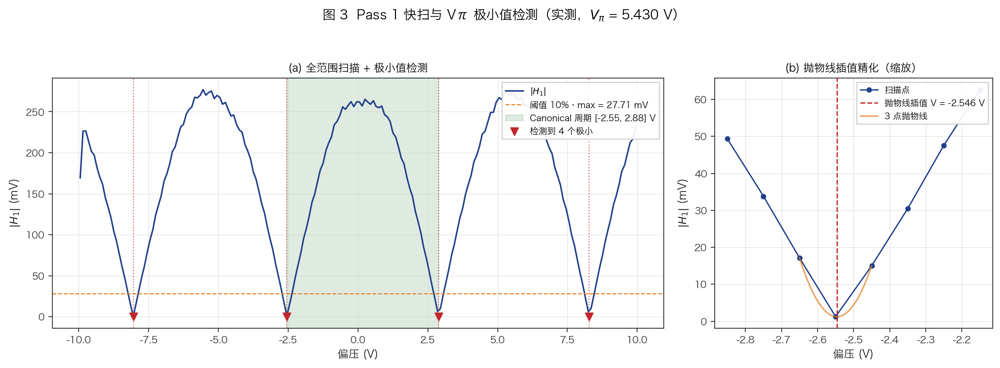

*图 3：实测 Pass 1 快扫（$\Delta V = 0.1$ V，3 block/step）下的 $|H_1|$ vs bias voltage。水平虚线为阈值（10% max），红色竖线为检测到的极小值位置，阴影区间为选中的 canonical 周期。提取到 $V_\pi = 5.451$ V。*

#### Canonical 周期选取

多个极小值定义了多个 $V_\pi$ 周期。为减小离散化误差，取**所有相邻极小值间距的平均值**：

$$V_\pi = \frac{1}{N_{\min} - 1} \sum_{i=0}^{N_{\min}-2} (V_{\min}^{(i+1)} - V_{\min}^{(i)})$$

**Canonical 周期**的选取规则：选择**中点绝对值最小**的相邻极小值对 $(V_{\min}^{(j)}, V_{\min}^{(j+1)})$：

$$j^* = \arg\min_j \left| \frac{V_{\min}^{(j)} + V_{\min}^{(j+1)}}{2} \right|$$

选择靠近 $V = 0$ 的周期有两个好处：
1. 最小化 DAC 输出范围需求，留出最大的动态余量
2. 减小 DAC 非线性（通常在量程边缘更大）的影响

Canonical 周期的两个边界就是 Pass 2 扫描窗口的参考点 $(V_{\mathrm{left}}, V_{\mathrm{right}})$。

#### Null/Peak 识别

两个 $H_1$ 零点分别对应 MIN（null）和 MAX（peak），通过 DC 光功率区分：

$$V_{\mathrm{null}} = \begin{cases} V_{\min}^{(j)} & \text{if } P_{\mathrm{DC}}(V_{\min}^{(j)}) < P_{\mathrm{DC}}(V_{\min}^{(j+1)}) \\ V_{\min}^{(j+1)} & \text{otherwise} \end{cases}$$

DC 功率低的是消光点（null），高的是最大传输点（peak）。

---

### 3.3 仿射模型最小二乘拟合

#### 模型定义

根据 §1.2 的理论分析，$H_1$ 和 $H_2$ 的有符号信号分别正比于 $\sin\varphi$ 和 $\cos\varphi$。考虑硬件增益、偏置和相位延迟后，实际测量的谐波信号可以用仿射模型表示：

$$\begin{bmatrix} H_1^s \\ H_2^s \end{bmatrix} = \begin{bmatrix} o_1 \\ o_2 \end{bmatrix} + \begin{bmatrix} m_{11} & m_{12} \\ m_{21} & m_{22} \end{bmatrix} \begin{bmatrix} \sin\varphi \\ \cos\varphi \end{bmatrix}$$

简写为 $\mathbf{h} = \mathbf{o} + M \mathbf{u}(\varphi)$，其中：
- $\mathbf{o} = (o_1, o_2)^T$：仪器偏置（Goertzel 零频泄漏、TIA 偏移等）
- $M$：$2 \times 2$ 矩阵，各元素包含光功率、Bessel 系数、TIA 增益、I/Q 投影方向等因素的综合效应
- $\mathbf{u}(\varphi) = (\sin\varphi, \cos\varphi)^T$：相位向量

**对角主导性**：理想情况下 $M$ 应该是对角矩阵（$H_1^s$ 仅依赖 $\sin\varphi$，$H_2^s$ 仅依赖 $\cos\varphi$），但硬件相位延迟引入的交叉耦合使 $m_{12}$ 和 $m_{21}$ 非零。通用仿射模型无需假设对角性，因此对任意硬件配置都适用。

#### 两阶段旋转基底拟合

直接对 $\sin(\pi V / V_\pi)$ 和 $\cos(\pi V / V_\pi)$ 做最小二乘会遇到一个问题：$V_\pi$ 从 Pass 1 得到，有约 $\pm 0.1$ V 的误差，导致相位 $\varphi = \pi V / V_\pi$ 在扫描范围边缘产生几度的误差，影响拟合精度。

固件采用**两阶段旋转基底**方法（`fit_affine_from_current_scan`）来消除此影响：

**阶段 1：确定 H1 的相位偏移 $\psi$**

以 $\omega = \pi / V_\pi$ 为角频率，对 $H_1^s$ 拟合三项模型：

$$H_1^s(V) = c_{\sin} \cdot \sin(\omega V) + c_{\cos} \cdot \cos(\omega V) + c_0$$

这是一个线性最小二乘问题。$c_{\sin}$ 和 $c_{\cos}$ 确定了 H1 信号相对于 $\sin(\omega V)$ 的旋转角：

$$\psi = \arctan\!\left(\frac{c_{\cos}}{c_{\sin}}\right)$$

**阶段 2：用旋转后的基底拟合两行**

定义旋转相位 $\phi_i = \omega V_i + \psi$，以 $(\sin\phi_i, \cos\phi_i)$ 为新基底，分别对 $H_1^s$ 和 $H_2^s$ 拟合：

$$H_1^s = m_{11} \sin\phi + m_{12} \cos\phi + o_1$$
$$H_2^s = m_{21} \sin\phi + m_{22} \cos\phi + o_2$$

其中 $H_2^s$ 先经过高斯平滑（$\sigma = 0.25$ V）以减小噪声对弱 $H_2$ 信号的影响。

旋转角 $\psi$ 被吸收进基底后，$\varphi = \phi - \psi_0$（其中 $\psi_0$ 是仿射逆变换的参考相位），使得拟合参数直接对应运行时的相位坐标。

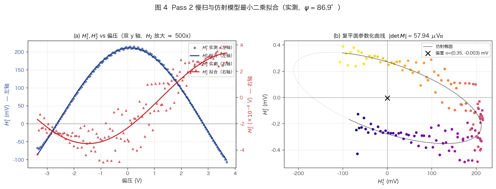

*图 4：(a) 实测 $H_1^s$、$H_2^s$ vs 偏压（散点）与仿射模型拟合（实线）。因 $H_2 \propto J_2(m) \approx 1\times 10^{-4}$ 比 $H_1 \propto J_1(m) \approx 1.4\times 10^{-2}$ 小约 500 倍（$J_2/J_1 \approx m/4$），故 $H_2^s$ 使用独立的右 y 轴显示。(b) 复平面上 $(H_1^s, H_2^s)$ 参数化曲线呈倾斜椭圆，标出仿射矩阵的旋转角 $\psi$ 与偏置向量 $\mathbf{o}$。理想单位圆 $(\sin\varphi, \cos\varphi)$ 经仿射变换后被拉伸、旋转并整体平移。*

#### 3×3 法方程推导

每行的拟合都是标准的三参数线性最小二乘。以 $H_1^s$ 为例，要最小化：

$$\sum_{i=1}^{n} \left[ H_1^{s,(i)} - (c_0 b_0^{(i)} + c_1 b_1^{(i)} + c_2) \right]^2$$

其中 $b_0^{(i)} = \sin\phi_i$，$b_1^{(i)} = \cos\phi_i$。法方程（normal equations）为 $A^T A \mathbf{c} = A^T \mathbf{y}$，展开为 $3 \times 3$ 线性系统：

$$\begin{bmatrix}
\sum b_0^2 & \sum b_0 b_1 & \sum b_0 \\
\sum b_0 b_1 & \sum b_1^2 & \sum b_1 \\
\sum b_0 & \sum b_1 & n
\end{bmatrix}
\begin{bmatrix} c_0 \\ c_1 \\ c_2 \end{bmatrix}
=
\begin{bmatrix} \sum b_0 y \\ \sum b_1 y \\ \sum y \end{bmatrix}$$

固件用列主元高斯消元法（`solve_3x3`）求解此增广矩阵，复杂度 $O(27)$（$3^3$），可忽略。

#### 行列式检验

拟合完成后检验仿射矩阵的非奇异性：

$$|\det M| = |m_{11} m_{22} - m_{12} m_{21}| > 10^{-8}$$

若行列式过小，说明 $H_1$ 和 $H_2$ 两行线性相关（例如 H2 使用了错误的 I/Q 分量导致 H2 行接近 H1 行的缩放），仿射逆变换会放大噪声，标定失败。

同时检验 $H_1$ 幅度 $\sqrt{c_{\sin}^2 + c_{\cos}^2} > 10^{-4}$，排除无光信号的情况。

#### RMSE 评估

拟合后计算残差均方根误差：

$$\mathrm{RMSE} = \sqrt{\frac{1}{n} \sum_{i=1}^{n} \left(y_i - \hat{y}_i\right)^2}$$

$H_1$ 和 $H_2$ 各有独立的 RMSE。典型值：
- $H_1$ RMSE: ~0.005 mV（信号幅度 ~5 mV，相对误差 ~0.1%）
- $H_2$ RMSE: ~0.002 mV（信号幅度 ~0.07 mV，相对误差 ~3%）

$H_2$ 的相对 RMSE 较大反映了 $J_2(m)$ 弱信号的固有信噪比限制。

---

### 3.4 锚点验证与 DC 校准

#### 锚点复测

Pass 2 扫描拟合得到的四个关键电压锚点需要逐一复测验证：

| 锚点 | 物理含义 | 测量量 | 验证标准 |
|------|---------|--------|---------|
| $V_{\mathrm{null}}$ | 消光点 $\varphi = 0$ | $H_1^s \approx 0$，$H_2^s$ 最大 | DC 功率最低 |
| $V_{\mathrm{peak}}$ | 最大传输 $\varphi = \pi$ | $H_1^s \approx 0$，$H_2^s$ 最大（反相） | DC 功率最高 |
| $V_{\mathrm{quad}+}$ | 正交 $\varphi = +\pi/2$ | $H_1^s$ 最大，$H_2^s \approx 0$ | $H_1^s > 0$ |
| $V_{\mathrm{quad}-}$ | 反正交 $\varphi = -\pi/2$ | $H_1^s$ 最大（反向），$H_2^s \approx 0$ | $H_1^s < 0$ |

每个锚点的测量过程（`measure_harmonics_at_bias`）：

1. 设置 DAC 到锚点电压，等待 100 ms 大跳稳定
2. 运行 1 个 Goertzel 块（1280 样本）作为预热丢弃
3. 连续测量 $n_{\mathrm{blocks}}$ 个块，鲁棒均值后输出 $(|H_1|, \theta_1, |H_2|, \theta_2, P_{\mathrm{DC}})$

**Null/Peak 修正**：如果复测发现 $P_{\mathrm{DC}}(\mathrm{peak}) < P_{\mathrm{DC}}(\mathrm{null})$（说明 Pass 1 的 DC 比较搞反了），交换两者。

**Quad+/Quad- 修正**：确保 $H_1^s(\mathrm{quad}+) > H_1^s(\mathrm{quad}-)$，即 quad+ 对应 $\sin\varphi > 0$ 的半平面。

#### DC 校准

DC 通道（ADC CH1）在 null 和 peak 两个已知工作点处的 TIA 输出电压建立了线性映射：

$$P_{\mathrm{DC}} = P_{\mathrm{null}} + \frac{P_{\mathrm{peak}} - P_{\mathrm{null}}}{2} [1 - \cos\varphi]$$

实测值（2026-04-13）：

| 参数 | 值 | 说明 |
|------|-----|------|
| $P_{\mathrm{null}}$ | $-0.001$ V | TIA 输出 @ 消光 |
| $P_{\mathrm{peak}}$ | $1.076$ V | TIA 输出 @ 最大传输 |
| 动态范围 | $1.077$ V | |

DC 通道在运行时**仅用于诊断和状态监测**（`diag_error_dc_term`），不参与误差计算或锁定判据。这是 spec-04 的核心设计原则：控制环路完全基于 $H_1/H_2$ 谐波信号，避免 DC 通道的漂移和温度依赖性影响控制精度。

#### 轴增益与符号标定

除仿射模型外，标定还提取了原始轴增益参数（向后兼容和诊断用）：

$$H_1^{\mathrm{offset}} = \frac{1}{2}[H_1^s(\mathrm{null}) + H_1^s(\mathrm{peak})]$$

$$H_1^{\mathrm{axis}} = |H_1^s(\mathrm{quad+}) - H_1^{\mathrm{offset}}|$$

$$H_2^{\mathrm{offset}} = H_2^s(\mathrm{quad+})$$

$$H_2^{\mathrm{axis}} = \frac{1}{2}[|H_2^s(\mathrm{null})| + |H_2^s(\mathrm{peak})|]$$

轴增益需满足 $H_1^{\mathrm{axis}} > 10^{-4}$ 且 $H_2^{\mathrm{axis}} > 10^{-5}$，否则标定失败。

#### obs_dc 种子禁用

标定过程中曾尝试在 QUAD 点测量 $H_2^s$ 作为 `obs_dc_est` 的初始种子，以加速运行时 obs_dc EMA 的收敛。然而实测发现 QUAD 处 $H_2 \to 0$（物理上 $\cos(\pi/2) = 0$），测量值完全由噪声主导，典型值 `obs_y_quad = -0.4508`——方向和幅度都是随机的。使用此种子后 obs_dc_est 被初始化为错误值，抵消了正确信号并阻止锁定。

最终设计：**禁用 obs_dc 种子**（`obs_y_quad = 0, obs_y_quad_valid = false`），让 obs_dc EMA 在运行时从零开始自然收敛。在 $\alpha = 0.50$、$\tau \approx 0.4$ s 的快速 EMA 下，收敛所需时间 $\sim 5 \times \tau \approx 2$ s，远快于工程需求。

---

## 4. 控制算法

### 4.1 比值法相位向量观测器

#### 仿射逆变换

标定阶段（§3.3）建立了仿射模型 $\mathbf{h} = \mathbf{o} + M\,\mathbf{u}(\varphi)$。运行时需要反向求解：给定测量值 $(H_1^s, H_2^s)$，估计相位向量 $\mathbf{u} = (\sin\varphi, \cos\varphi)^T$。

$$\mathbf{u}_{\mathrm{meas}} = M_{\mathrm{eff}}^{-1} \cdot (\mathbf{h} - \mathbf{o})$$

其中 $M_{\mathrm{eff}}$ 是经贝塞尔补偿后的仿射矩阵（见下文）。

$2 \times 2$ 矩阵求逆的显式公式：

$$M^{-1} = \frac{1}{\det M} \begin{bmatrix} m_{22} & -m_{12} \\ -m_{21} & m_{11} \end{bmatrix}$$

$$x_{\mathrm{meas}} = \frac{m_{22}(H_1^s - o_1) - m_{12}(H_2^s - o_2)}{\det M}$$

$$y_{\mathrm{meas}} = \frac{-m_{21}(H_1^s - o_1) + m_{11}(H_2^s - o_2)}{\det M}$$

其中 $(x_{\mathrm{meas}}, y_{\mathrm{meas}}) \approx (\sin\varphi, \cos\varphi)$（尚未归一化）。

#### 贝塞尔补偿

若运行时导频幅度 $A_p^{\mathrm{now}} \neq A_p^{\mathrm{cal}}$（标定时的值），则调制指数 $m$ 变化，谐波幅度通过 Bessel 函数按比例变化。仿射矩阵各行需独立缩放：

$$M_{\mathrm{eff}} = \begin{bmatrix} r_1 \cdot m_{11} & r_1 \cdot m_{12} \\ r_2 \cdot m_{21} & r_2 \cdot m_{22} \end{bmatrix}$$

其中：

$$r_1 = \frac{J_1(m_{\mathrm{now}})}{J_1(m_{\mathrm{cal}})}, \qquad r_2 = \frac{J_2(m_{\mathrm{now}})}{J_2(m_{\mathrm{cal}})}$$

$J_1$ 和 $J_2$ 对 $m$ 的缩放关系不同（$J_1 \sim m$，$J_2 \sim m^2$），因此**两行必须独立补偿**。

固件中 `scale_axis_for_pilot()` 函数计算此比值，使用 §1.3 中的幂级数实现。当 $A_p^{\mathrm{now}} = A_p^{\mathrm{cal}}$ 时 $r_1 = r_2 = 1$，无需补偿。

#### 归一化与功率无关性

逆变换得到的 $(x_{\mathrm{meas}}, y_{\mathrm{meas}})$ 的模长取决于光功率：

$$r_{\mathrm{meas}} = \sqrt{x_{\mathrm{meas}}^2 + y_{\mathrm{meas}}^2}$$

通过归一化到单位圆：

$$\hat{x} = x_{\mathrm{meas}} / r_{\mathrm{meas}}, \qquad \hat{y} = y_{\mathrm{meas}} / r_{\mathrm{meas}}$$

得到 $(\hat{x}, \hat{y}) \approx (\sin\varphi, \cos\varphi)$，不依赖于：

1. **光功率 $P_{\mathrm{in}}$**：$P_{\mathrm{in}}$ 作为公共因子出现在 $H_1^s$ 和 $H_2^s$ 中，被比值消除
2. **TIA 增益 $R$**：同上
3. **光电探测器响应度 $\eta$**：同上

**证明**：设光功率从 $P_0$ 变为 $P_0(1+\delta)$，则 $\mathbf{h} \to (1+\delta)\mathbf{h}_{\mathrm{sig}} + \mathbf{o}$。偏置 $\mathbf{o}$ 主要来自仪器零点（不随光功率变化），故：

$$\mathbf{u}_{\mathrm{meas}} = M^{-1}[(1+\delta)\mathbf{h}_{\mathrm{sig}} + \mathbf{o} - \mathbf{o}] = (1+\delta) M^{-1}\mathbf{h}_{\mathrm{sig}} = (1+\delta)\mathbf{u}_0$$

归一化后 $(1+\delta)$ 被消除。

这是**比值法**（ratiometric method）的核心优势：只要 $H_1$ 和 $H_2$ 来自同一光电检测链路，光功率的慢变化不会影响相位估计。

---

### 4.2 自适应增益观测器

#### EMA 更新方程

归一化后的 $(\hat{x}, \hat{y})$ 是瞬时测量值，噪声较大（尤其是在 QUAD 附近 $H_2 \to 0$ 时 $\hat{y}$ 噪声爆炸）。通过 EMA 观测器平滑：

$$\mathrm{obs}_x[n] = \mathrm{obs}_x[n-1] + \alpha_x \cdot (\hat{x}[n] - \mathrm{obs}_x[n-1])$$
$$\mathrm{obs}_y[n] = \mathrm{obs}_y[n-1] + \alpha_y \cdot (\hat{y}[n] - \mathrm{obs}_y[n-1])$$

每次更新后重新归一化到单位圆：

$$r = \sqrt{\mathrm{obs}_x^2 + \mathrm{obs}_y^2}, \qquad \mathrm{obs}_x \mathrel{/}= r, \quad \mathrm{obs}_y \mathrel{/}= r$$

双重归一化（测量值和观测器输出）确保相位向量始终在单位圆上。

#### 增益调度

$\alpha_x$ 和 $\alpha_y$ 根据目标工作点自适应调节。关键约束：

- **QUAD** ($\varphi = \pi/2$)：$H_1 \propto \sin\varphi \to 1$（强），$H_2 \propto \cos\varphi \to 0$（弱）。$x = \sin\varphi$ 可靠，$y = \cos\varphi$ 噪声大 → $\alpha_x$ 大，$\alpha_y$ 小。
- **MIN/MAX** ($\varphi = 0$ 或 $\pi$)：$H_1 \to 0$，$H_2$ 强 → 反过来，$\alpha_y$ 可较大。

增益调度公式：

$$\text{blend}_x = |\cos\varphi_{\mathrm{target}}|, \qquad \text{blend}_y = |\sin\varphi_{\mathrm{target}}|$$

$$\alpha_x = \alpha_{x,\mathrm{QUAD}} + (\alpha_{x,\mathrm{MINMAX}} - \alpha_{x,\mathrm{QUAD}}) \cdot \text{blend}_x$$

$$\alpha_y = \alpha_{y,\mathrm{QUAD}} + (\alpha_{y,\mathrm{MINMAX}} - \alpha_{y,\mathrm{QUAD}}) \cdot \text{blend}_y$$

**参数值**：

| 参数 | QUAD 值 | MIN/MAX 值 | 说明 |
|------|---------|-----------|------|
| $\alpha_x$ | 0.08 | 0.30 | QUAD 处 $x=\sin\varphi$ 大，不需快追踪 |
| $\alpha_y$ | 0.005 | 0.02 | QUAD 处 $y=\cos\varphi\to0$，必须极慢滤波 |

$\alpha_y = 0.005$ 在 QUAD 处的等效时间常数：

$$\tau_y = -\frac{T_{\mathrm{ctrl}}}{\ln(1-\alpha_y)} = -\frac{200\ \mathrm{ms}}{\ln(0.995)} \approx 40\ \text{s}$$

这意味着 obs_y 在 QUAD 附近对噪声的响应非常缓慢，保护了冷启动时从标定种子获得的正确符号。

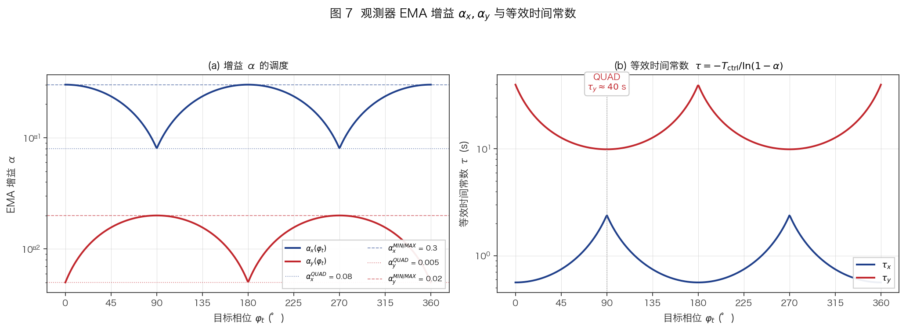

*图 7：主轴为 $\alpha_x$、$\alpha_y$（对数尺度，因跨 $[5\times 10^{-3}, 0.30]$ 区间）；次轴为对应的等效时间常数。QUAD 处 $\alpha_y = 0.005$（$\tau_y \approx 40$ s）把 $\cos\varphi$ 通道的噪声压到极小，保护冷启动种子符号；MIN/MAX 处 $\alpha_y = 0.02$ 允许快追踪。$\alpha_x$ 调度与之互补。*

#### 冷启动种子

首次更新时（`observer_valid == false`），不使用原始测量值 $(\hat{x}, \hat{y})$ 种子观测器，而是从标定偏压位置推算：

$$\phi_{\mathrm{seed}} = \frac{\pi (V_{\mathrm{bias}} - V_{\mathrm{null}})}{V_\pi}$$

$$\mathrm{obs}_x = \sin\phi_{\mathrm{seed}}, \qquad \mathrm{obs}_y = \cos\phi_{\mathrm{seed}}$$

**为什么不用测量值种子？**

在 QUAD 附近，$H_2 \to 0$ 导致 $y_{\mathrm{meas}}$ 的相对噪声极大，可能产生**错误符号**的 $\mathrm{obs}_y$。错误符号使得 $\mathrm{error} = \mathrm{obs}_y$ 反向，PI 控制器将偏压推向错误方向，形成正反馈直到触及输出限幅。

粗扫描（coarse sweep）已将偏压定位到目标附近，因此从偏压位置推算的种子具有正确的符号和近似正确的幅度，足以让 PI 从近零误差启动。

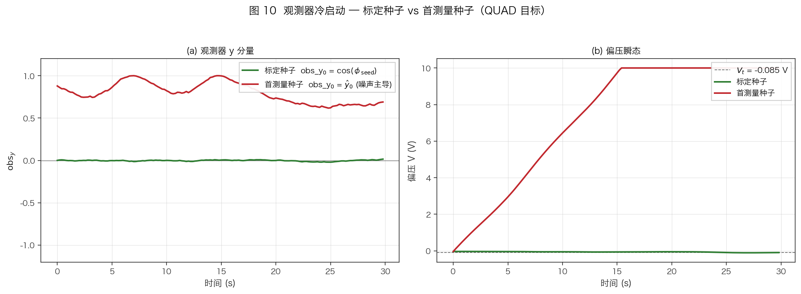

*图 10：QUAD 目标、$H_2$ 测量噪声 $\sigma = 0.3$ 场景下的解析仿真。绿色曲线从标定种子 $\mathrm{obs}_y = \cos\phi_{\mathrm{seed}}$ 起步 → 正确收敛、偏压稳定在 $V_t$；红色曲线从首个噪声测量值起步，错误符号导致 PI 反向积分、偏压迅速触及 $+10$ V 限幅。*

#### 相位解缠

从 $(\mathrm{obs}_x, \mathrm{obs}_y)$ 提取的主值相位 $\phi = \mathrm{atan2}(\mathrm{obs}_x, \mathrm{obs}_y)$ 可能在 $\pm\pi$ 处不连续。通过最近整数圈解缠：

$$\phi_{\mathrm{unwrap}} = \phi_{\mathrm{principal}} + 2\pi \left\lfloor \frac{\phi_{\mathrm{ref}} - \phi_{\mathrm{principal}}}{2\pi} + 0.5 \right\rfloor$$

其中 $\phi_{\mathrm{ref}}$ 为上次有效相位估计（首次时为目标相位）。

#### 跳变拒绝

当单步相位变化过大时（$|\Delta\phi| > \pi/2$），说明可能发生了半波电压跳周期或异常扰动：

$$|\phi_{\mathrm{candidate}} - \phi_{\mathrm{prev}}| > \frac{\pi}{2} \quad \Rightarrow \quad \text{拒绝此更新}$$

被拒绝时设置 `phase_jump_rejected = true`，误差输出为 0（不驱动 PI），等待下一个正常的测量值。

---

### 4.3 统一误差信号 + 电压弹簧

#### 统一相位误差

本系统最关键的设计之一是**统一误差公式**——对所有工作点（QUAD/MIN/MAX/CUSTOM）使用同一个误差表达式：

$$\mathrm{error} = \mathrm{obs\_term} + \mathrm{spring\_term}$$

其中 obs_term 是基于相位向量观测器的误差项，spring_term 是基于偏压电压的弹簧项。

#### obs_term 推导

定义目标相位向量为 $\mathbf{u}_t = (\sin\varphi_t, \cos\varphi_t)^T$，观测器相位向量为 $\mathbf{u}_{\mathrm{obs}} = (\mathrm{obs}_x, \mathrm{obs}_y)^T$。误差应度量两者之间的偏差。

取**叉积投影**：

$$\mathrm{obs\_term\_raw} = \sin\varphi_t \cdot \mathrm{obs}_y - \cos\varphi_t \cdot \mathrm{obs}_x$$

当 $\mathrm{obs}_x = \sin\varphi$，$\mathrm{obs}_y = \cos\varphi$ 时：

$$\mathrm{obs\_term\_raw} = \sin\varphi_t \cos\varphi - \cos\varphi_t \sin\varphi = \sin(\varphi_t - \varphi)$$

即误差正比于 $\sin(\Delta\varphi)$，在平衡点 $\Delta\varphi = 0$ 处具有**线性鉴相特性**，且在 $|\Delta\varphi| < \pi$ 范围内具有唯一零交叉——保证全局收敛性（在单个 $V_\pi$ 周期内）。

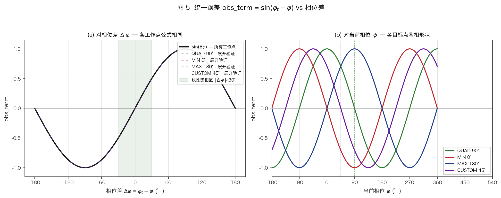

*图 5：四条曲线对应不同目标相位 $\varphi_t$（QUAD 90°、MIN 0°、MAX 180°、CUSTOM 45°）下的 obs_term_raw vs $\Delta\varphi = \varphi_t - \varphi$。所有曲线在 $\Delta\varphi = 0$ 处过零（线性鉴相区域高亮），且斜率相同——统一误差公式对所有工作点形状一致。*

**各工作点简化**：

| 工作点 | $\varphi_t$ | $\sin\varphi_t$ | $\cos\varphi_t$ | obs_term_raw |
|--------|-------------|-----------------|-----------------|-------------|
| QUAD | $\pi/2$ | 1 | 0 | $\mathrm{obs}_y$ |
| MIN | $0$ | 0 | 1 | $-\mathrm{obs}_x$ |
| MAX | $\pi$ | 0 | $-1$ | $\mathrm{obs}_x$ |
| CUSTOM $\varphi_t$ | $\varphi_t$ | $\sin\varphi_t$ | $\cos\varphi_t$ | 完整公式 |

QUAD 处误差退化为 $\mathrm{obs}_y \approx \cos\varphi$——正是 $H_2$ 信号的归一化版本。

#### 电压弹簧

在 QUAD 附近，$H_2 \to 0$ 使得 obs_term_raw 被噪声主导。纯积分控制在噪声主导时会随机游走（积分器累积噪声偏置）。电压弹簧提供一个不依赖光信号的**恢复力**：

$$\mathrm{spring\_term} = -K_s \cdot w(\varphi_t) \cdot \frac{V_{\mathrm{bias}} - V_{\mathrm{target}}}{V_\pi}$$

其中：
- $K_s = 0.60$：弹簧刚度
- $w(\varphi_t) = \sin^2\varphi_t$：权重函数
- $V_{\mathrm{target}}$：标定时确定的目标偏压
- $V_\pi$：归一化因子

**权重函数的设计意图**：

$$w(\varphi_t) = \sin^2\varphi_t = \begin{cases} 1.0 & \text{QUAD } (\varphi_t = \pi/2) \\ 0.0 & \text{MIN } (\varphi_t = 0) \\ 0.0 & \text{MAX } (\varphi_t = \pi) \\ \sin^2\varphi_t & \text{CUSTOM} \end{cases}$$

- QUAD：弹簧全力工作，因为 obs_term 噪声主导
- MIN/MAX：弹簧权重为零，完全由 obs_term 控制（此处 $H_1$ 或 $H_2$ 信号强，obs_term 可靠）
- CUSTOM：弹簧强度连续过渡，越接近 QUAD 弹簧越强

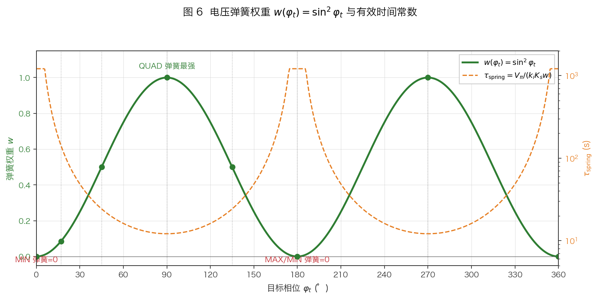

*图 6：主轴为权重 $w = \sin^2\varphi_t$，次轴为等效时间常数 $\tau_{\mathrm{spring}} = V_\pi / (k_i K_s w)$。QUAD 处 $w = 1$（弹簧最强，$\tau \approx 12$ s），MIN/MAX 处 $w = 0$（弹簧关闭），CUSTOM 17°/45°/135° 标出中间值。*

弹簧不依赖任何光学信号——它是纯电压域的恢复力，因此对光功率变化、导频幅度变化完全免疫。

#### 弹簧时间常数

将弹簧线性化后，假设 obs_term = 0，PI 积分器方程为：

$$V_{\mathrm{bias}}[n+1] = V_{\mathrm{bias}}[n] + k_i \cdot T_{\mathrm{ctrl}} \cdot \mathrm{spring\_term}$$

$$= V_{\mathrm{bias}}[n] - k_i T_{\mathrm{ctrl}} K_s w \frac{V_{\mathrm{bias}}[n] - V_{\mathrm{target}}}{V_\pi}$$

这是一阶线性差分方程，衰减率 $\lambda = k_i T_{\mathrm{ctrl}} K_s w / V_\pi$。在 QUAD（$w = 1$）处：

$$\tau_{\mathrm{spring}} = \frac{T_{\mathrm{ctrl}}}{\lambda} = \frac{V_\pi}{k_i K_s} = \frac{5.45}{0.75 \times 0.60} \approx 12.1\ \text{s}$$

即偏压从任意初始位置指数衰减到 $V_{\mathrm{target}}$，时间常数约 12 s。这比 obs_dc EMA 的时间常数（0.4 s）慢得多，是稳定性设计的关键约束（见 §5.4）。

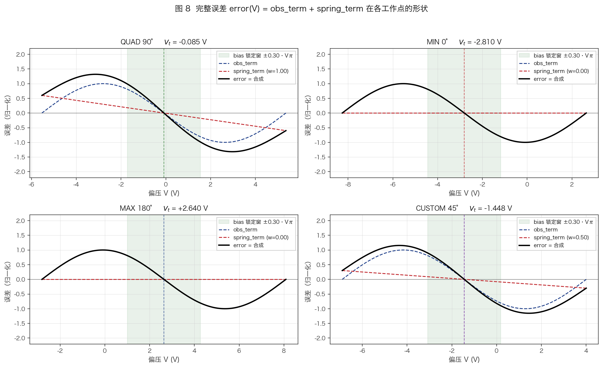

*图 8：2×2 子图给出 QUAD / MIN / MAX / CUSTOM 45° 处 error(V) 的分解。蓝虚线为 obs_term，红虚线为 spring_term，黑实线为合成 error。阴影区间为 lock 判据 $|V - V_t| \le 0.30 V_\pi$。QUAD 处二者协同推向零点；MIN/MAX 处 spring = 0，仅靠 obs_term；CUSTOM 则呈中间形态。*

---

### 4.4 obs_dc 在线偏置修正

#### 问题描述

在 QUAD 附近，obs_term_raw $= \mathrm{obs}_y \approx \cos\varphi$。当偏压精确在 QUAD 时 $\cos(\pi/2) = 0$，但由于：

1. 仿射模型残差（$H_2$ 拟合的系统性偏差）
2. 观测器 EMA 的初始化偏置
3. 噪声的非零均值（有限采样时间）

obs_term_raw 的**期望值不为零**：$\langle \mathrm{obs\_term\_raw} \rangle = b_{\mathrm{obs}} \neq 0$。

这个偏置通过 PI 积分器累积，将偏压从 $V_{\mathrm{target}}$ 推偏——弹簧随即产生反向力，两者达到平衡时偏压稳定在 $V_{\mathrm{target}} + \Delta V$，产生静态偏差。

#### EMA 追踪与修正

用快速 EMA 追踪 obs_term_raw 的均值并减去：

$$\mathrm{obs\_dc\_est}[n] = \mathrm{obs\_dc\_est}[n-1] + \alpha_{\mathrm{dc}} \cdot (\mathrm{obs\_term\_raw}[n] - \mathrm{obs\_dc\_est}[n-1])$$

$$\mathrm{obs\_term\_corr} = \mathrm{obs\_term\_raw} - \mathrm{obs\_dc\_est}$$

参数：$\alpha_{\mathrm{dc}} = 0.50$，对应时间常数：

$$\tau_{\mathrm{dc}} = -\frac{200\ \mathrm{ms}}{\ln(0.50)} = 0.29\ \text{s} \approx 0.4\ \text{s}$$

修正后的 obs_term_corr 在 QUAD 处期望值为零，消除了积分器的系统性偏置。

#### Warmup 机制

在 EMA 收敛前应用修正会引入瞬态误差。Warmup 机制：

- 前 $N_w = 5$ 个控制更新（1 s）内：无条件更新 obs_dc_est（快速收敛），但**不应用修正**
- 第 5 个更新后：开始从 obs_term_raw 中减去 obs_dc_est

#### 锁定门控

Warmup 完成后，obs_dc_est **仅在锁定状态下更新**。原因：

- 未锁定时（如启动过渡、工作点切换），偏压可能远离目标，obs_term_raw 的值反映的是当前（错误）相位而非 QUAD 处的偏置 $b_{\mathrm{obs}}$
- 如果在未锁定时更新 obs_dc_est，会将瞬态值"记住"，锁定后产生错误修正

锁定门控保证 obs_dc_est 始终追踪**稳态**下的偏置，而非瞬态值。

#### α=0.01 极限环分析

早期版本使用 $\alpha_{\mathrm{dc}} = 0.01$（$\tau \approx 20$ s）。实测出现约 60 s 周期的**极限环振荡**，机制如下：

1. 初始偏压在 $V_{\mathrm{target}}$ 附近。obs_term_raw 有小偏置 $b_0$
2. obs_dc_est 缓慢追踪 $b_0$（τ=20 s），开始从 obs_term_raw 中减去修正
3. 修正使 PI 积分器向反方向积累，偏压开始偏移
4. 弹簧随偏压偏移产生恢复力，将偏压拉回
5. 但 obs_dc_est 仍在追踪**旧的** obs_term_raw（因为 τ=20 s 远慢于弹簧的 τ≈12 s），形成**过修正**
6. 过修正 → 偏压向另一侧偏移 → obs_dc_est 再次追踪 → 循环

本质上这是一个弹簧-EMA 耦合振荡：EMA 的延迟（20 s）大于弹簧的响应时间（12 s），在反馈环路中引入了相位裕度不足的慢极点。

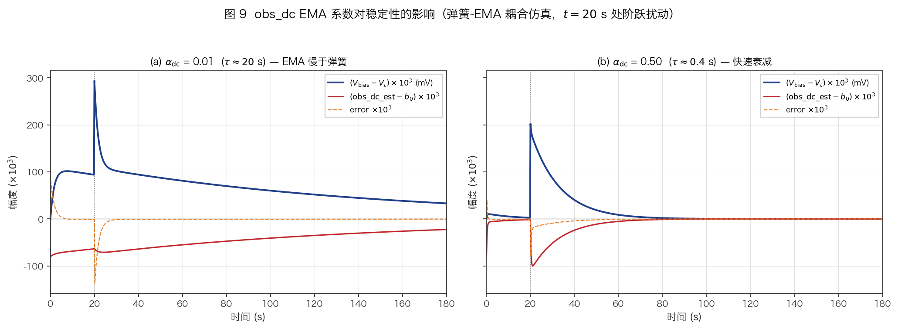

*图 9：$t = 20$ s 注入一次 obs_term_raw 阶跃扰动后的解析仿真。左图 $\alpha = 0.01$（$\tau \approx 20$ s，慢于弹簧）呈现耦合慢极点下的极限环；右图 $\alpha = 0.50$（$\tau \approx 0.4$ s）快速吸收偏置，偏压静止在 $V_t$，不形成振荡。*

**解决方案**：$\alpha_{\mathrm{dc}} = 0.50$（$\tau \approx 0.4$ s $\ll \tau_{\mathrm{spring}} \approx 12$ s），使 obs_dc_est 追踪速度远快于弹簧响应。obs_dc_est 在每个弹簧步进周期内就完成收敛，不形成延迟反馈。

---

### 4.5 obs_term 低通滤波

obs_dc 修正后的 obs_term_corr 经过一级 EMA 低通滤波：

$$\mathrm{obs\_error\_filt}[n] = \mathrm{obs\_error\_filt}[n-1] + \alpha_{\mathrm{obs}} \cdot (\mathrm{obs\_term\_corr}[n] - \mathrm{obs\_error\_filt}[n-1])$$

滤波器增益 $\alpha_{\mathrm{obs}}$ 根据弹簧权重 $w$ 连续混合：

$$\alpha_{\mathrm{obs}} = 1.0 + w \cdot (\alpha_{\mathrm{QUAD}} - 1.0)$$

| 工作点 | $w = \sin^2\varphi_t$ | $\alpha_{\mathrm{obs}}$ | 效果 |
|--------|----------------------|------------------------|------|
| MIN/MAX | 0 | 1.0（直通） | obs_term_corr 可靠，不需平滑 |
| QUAD | 1 | 0.10 | 重度平滑，$\tau \approx 1.9$ s |
| CUSTOM 45° | 0.5 | 0.55 | 中等平滑 |

QUAD 处的重度平滑与 obs_dc 修正协同工作：obs_dc 消除了均值偏置，低通滤波进一步抑制残余噪声的高频分量，使 PI 积分器只看到缓慢变化的真实误差信号。

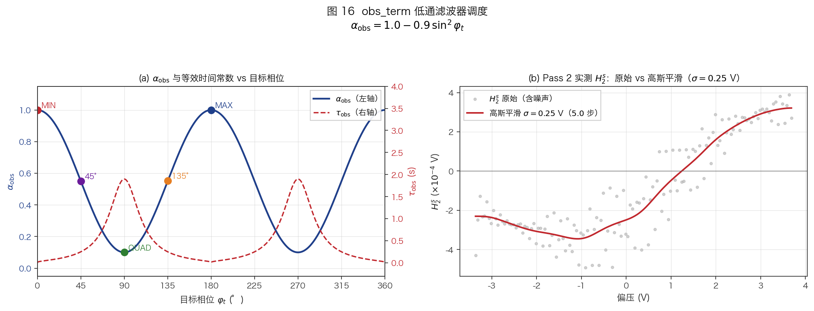

*图 16：(a) $\alpha_{\mathrm{obs}} = 1.0 - 0.9\sin^2\varphi_t$（蓝色，左轴）与等效时间常数 $\tau_{\mathrm{obs}}$（红色虚线，右轴）vs 目标相位。MIN/MAX 处 $\alpha_{\mathrm{obs}} = 1.0$（直通，$\tau = 0$），QUAD 处 $\alpha_{\mathrm{obs}} = 0.10$（$\tau \approx 1.9$ s），CUSTOM 工作点连续过渡。(b) Pass 2 实测 $H_2^s$ 原始散点（灰）与高斯平滑曲线（红，$\sigma = 0.25$ V）对比；$H_2$ 幅度约 $4\times 10^{-4}$ V，噪声相对信号约 30% —— 平滑对后续仿射拟合的正常法方程 $A^T A$ 条件数改善显著。*

冷启动时首次更新直接赋值（避免从零缓慢爬升）。

---

### 4.6 PI 控制器

#### 离散 PI 更新方程

本系统使用比例-积分（PI）控制器，输出为绝对偏压（不是偏压增量）：

$$\mathrm{integral}[n] = \mathrm{integral}[n-1] + e[n] \cdot T_{\mathrm{ctrl}}$$

$$V_{\mathrm{bias}}[n] = k_p \cdot e[n] + k_i \cdot \mathrm{integral}[n]$$

其中 $e[n]$ 为当前误差，$T_{\mathrm{ctrl}} = 0.200$ s 为控制周期。

**参数**：

| 参数 | 值 | 说明 |
|------|-----|------|
| $k_p$ | 0.005 | 比例增益（所有工作点统一） |
| $k_i$ | 0.75 | 积分增益（所有工作点统一） |
| $T_{\mathrm{ctrl}}$ | 0.200 s | 控制周期 |
| 输出范围 | $[-10, +10]$ V | DAC 限幅 |

#### 抗饱和（Anti-Windup）

积分器限幅防止 windup：

$$\mathrm{int\_min} = \frac{\mathrm{out\_min}}{k_i} = \frac{-10}{0.75} = -13.33$$

$$\mathrm{int\_max} = \frac{\mathrm{out\_max}}{k_i} = \frac{+10}{0.75} = +13.33$$

注意积分限幅是按 $\mathrm{out} / k_i$ 计算的，不是直接用输出限幅。如果直接用 $\pm 10$ 作为积分限幅，则积分项 $k_i \times \mathrm{integral}$ 可达 $\pm 7.5$ V，远超输出范围，造成 windup 后误差反向时需要很多步才能 unwind。

#### 积分器种子

`bias_ctrl_start()` 时将积分器从当前偏压反推种子：

$$\mathrm{integral}_0 = \frac{V_{\mathrm{bias}}}{k_i}$$

这保证闭环启动瞬间 PI 输出 $\approx V_{\mathrm{bias}}$（$k_p \cdot e[0]$ 贡献很小），不会在切换到闭环时产生电压跳变。

---

### 4.7 锁定判据

#### 五条件联合判定

每个控制周期评估 5 个独立条件，**全部满足**才算锁定：

| 条件 | 公式 | 物理意义 |
|------|------|---------|
| `bias_ok` | $\|V_{\mathrm{bias}} - V_{\mathrm{target}}\| \leq 0.30 V_\pi$ | 防跨周期锁定 |
| `observer_ok` | `phase_valid ∧ ¬jump_rejected ∧ observer_valid` | 观测器状态健康 |
| `radius_ok` | $r = \sqrt{\mathrm{obs}_x^2 + \mathrm{obs}_y^2} \geq 0.10$ | 信号强度足够 |
| `error_ok` | $\|e\| < 0.20/\pi \approx 0.0637$ | 误差足够小 |
| `phase_ok` | 工作点相关（见下表） | 相位半平面正确 |

**phase_ok 条件**：

| 工作点 | phase_ok 判据 | 物理含义 |
|--------|-------------|---------|
| QUAD | $\mathrm{obs}_x > 0$ | $\sin\varphi > 0$，即在 $0 < \varphi < \pi$ 半平面 |
| MIN | $\mathrm{obs}_y > 0$ | $\cos\varphi > 0$，即 $\|\varphi\| < \pi/2$ |
| MAX | $\mathrm{obs}_y < 0$ | $\cos\varphi < 0$，即 $\pi/2 < \varphi < 3\pi/2$ |
| CUSTOM | 始终 true | 自定义角度不强制半平面约束 |

phase_ok 的作用是防止锁定到**相邻周期的镜像工作点**——例如 QUAD 在 $\varphi = \pi/2$ 和 $\varphi = -\pi/2$ 处误差都为零，但 $\sin\varphi$ 的符号不同。

#### hold_assist 机制

$$\mathrm{lock\_streak} = \begin{cases} \mathrm{lock\_streak} + 1 & \text{if locked} \\ 0 & \text{if not locked} \end{cases}$$

$$\mathrm{hold\_assist\_active} = (\mathrm{lock\_streak} \geq 25)$$

连续 25 次锁定（$25 \times 200\ \mathrm{ms} = 5$ s）后确认进入稳定锁定状态。hold_assist 目前用于：

- obs_dc EMA 的锁定门控（§4.4）
- 外部状态报告（UART 诊断输出）

任何一次失锁都将 lock_streak 清零，需重新积累 25 次。这避免了瞬态误差被误报为锁定。

#### Fallback 判据

当仿射模型不可用（`affine_valid = false`）时，退回到原始谐波信号的简化判据：

| 工作点 | 判据 |
|--------|-----|
| QUAD | $\|H_2^s\| < 0.01$ 且 $H_1^s > 0$ |
| MAX | $\|H_1^s\| < 0.01$ 且 $H_2^s < 0$ |
| MIN | $\|H_1^s\| < 0.01$ 且 $H_2^s > 0$ |

Fallback 判据仅检查零交叉附近的幅度和符号，精度远不如归一化相位向量，但可在标定失败后提供基本的锁定检测。

---

## 5. 理论分析

### 5.1 噪声分析

#### ADC 噪底

ADS131M02 在 HR 模式、OSR=128（64 kSPS）下的典型输入参考噪声约 $\sigma_{\mathrm{ADC}} \approx 1\ \mu\mathrm{V_{rms}}$（数据手册典型值）。转换为 ADC code 标准差：

$$\sigma_{\mathrm{code}} = \frac{\sigma_{\mathrm{ADC}}}{V_{\mathrm{LSB}}} = \frac{1\ \mu\mathrm{V}}{1.2\ \mathrm{V} / 2^{23}} \approx 7\ \mathrm{code}$$

（满量程 $\pm 1.2$ V，24-bit ADC，$V_{\mathrm{LSB}} \approx 143$ nV）

#### Goertzel 输出 SNR

对于幅度为 $A$ 的导频信号叠加白噪声 $\sigma_n$，单块 Goertzel（$N = 1280$）的幅度估计标准差为：

$$\sigma_{\hat{A}} = \frac{\sigma_n \sqrt{2}}{\sqrt{N}} = \frac{\sigma_n \sqrt{2}}{\sqrt{1280}} \approx 0.0395 \sigma_n$$

本系统导频在 ADC 端的信号幅度（经 TIA 后、扣除 DC）：

- $H_1$ at QUAD: $R\eta P_{\mathrm{in}} J_1(m) \approx 5$ mV（典型值）
- $H_2$ at NULL: $R\eta P_{\mathrm{in}} J_2(m) \approx 0.07$ mV

以 ADC 噪底 $\sigma_{\mathrm{ADC}} = 1\ \mu$V 计算单块 SNR：

$$\mathrm{SNR}_{H_1} = \frac{A_{H_1}}{\sigma_{\hat{A}}} = \frac{5\ \mathrm{mV}}{0.0395 \times 1\ \mu\mathrm{V}} \approx 1.27 \times 10^5 \quad (102\ \mathrm{dB})$$

$$\mathrm{SNR}_{H_2} = \frac{A_{H_2}}{\sigma_{\hat{A}}} \approx \frac{0.07\ \mathrm{mV}}{0.0395\ \mu\mathrm{V}} \approx 1770 \quad (65\ \mathrm{dB})$$

经过 10 块鲁棒均值 + IQ EMA（等效增益约 $\sqrt{10/0.20} \approx 7$），运行时 SNR 进一步提升约 17 dB。

#### 归一化后的相位噪声

归一化相位向量 $(\hat{x}, \hat{y}) = (\sin\varphi, \cos\varphi)$ 的噪声标准差取决于逆仿射变换后 $x_{\mathrm{meas}}, y_{\mathrm{meas}}$ 的噪声，再除以 radius $r$。

相位估计 $\hat\varphi = \mathrm{atan2}(\hat{x}, \hat{y})$ 的标准差由误差传播给出：

$$\sigma_\varphi \approx \sqrt{\sigma_{\hat{x}}^2 + \sigma_{\hat{y}}^2}$$

在 QUAD 处：$\hat{x} \approx 1$（大），$\hat{y} \approx 0$（噪声主导）。相位噪声主要由 $\hat{y}$ 贡献：

$$\sigma_\varphi \approx \sigma_{\hat{y}} = \frac{\sigma_{y,\mathrm{meas}}}{r}$$

实测 QUAD 稳态 DC 相位标准差为 $0.10°$（表 7.3），对应 $\sigma_\varphi = 0.0017$ rad。

---

### 5.2 灵敏度分析

#### 误差信号对相位的灵敏度

误差信号 $e = \sin(\varphi_t - \varphi)$（忽略弹簧和 obs_dc 修正）。在平衡点 $\varphi = \varphi_t$ 处的线性化灵敏度：

$$\left.\frac{\partial e}{\partial \varphi}\right|_{\varphi=\varphi_t} = -\cos(\varphi_t - \varphi)\bigg|_{\varphi=\varphi_t} = -1$$

所有工作点具有**相同的小信号灵敏度** $\partial e/\partial\varphi = -1$。这是统一误差公式的重要特性：无论目标相位如何，闭环增益在平衡点附近恒定。

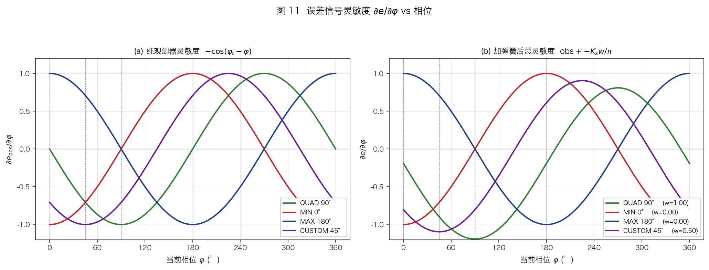

*图 11：(a) 纯观测器灵敏度 $-\cos(\varphi_t - \varphi)$；(b) 加上电压弹簧后的总灵敏度 $\mathrm{obs} + K_s \pi/V_\pi$。四条曲线分别对应 QUAD/MIN/MAX/CUSTOM 45° 目标。关键观察：所有工作点在平衡点处斜率均为 $-1$，闭环增益不随目标变化；弹簧仅对 QUAD/CUSTOM 贡献额外偏置，保持线性鉴相特性。*

传统方案（如仅用 $H_2$ 锁 QUAD、仅用 $H_1$ 锁 MIN/MAX）的灵敏度随工作点变化且在切换点退化，需要不同的 PI 参数。

#### 光功率不敏感性

设光功率为 $P$，谐波信号为 $H_n \propto P$。经仿射逆变换后：

$$x_{\mathrm{meas}} \propto P, \qquad y_{\mathrm{meas}} \propto P$$

归一化：

$$\hat{x} = \frac{x_{\mathrm{meas}}}{r_{\mathrm{meas}}} = \frac{P \cdot x_0}{P \cdot r_0} = \frac{x_0}{r_0}$$

$P$ 被消除。因此，$\hat{x}, \hat{y}$ 以及误差 $e$ **与光功率无关**（一阶近似）。

**二阶效应**：仿射偏置 $\mathbf{o}$ 中可能存在与光功率相关的分量（如 TIA 的温度漂移被光热效应调制）。此时 $x_{\mathrm{meas}} = P \cdot f(\varphi) + o_{\mathrm{offset}}$，归一化不能完全消除 $o_{\mathrm{offset}} / (P \cdot r_0)$ 项。但在 $P \cdot r_0 \gg o_{\mathrm{offset}}$ 时可忽略。

#### 导频幅度不敏感性

导频幅度变化通过 Bessel 补偿（§4.1）被消除。补偿后等效于标定时的调制指数，归一化进一步消除了剩余的幅度因子。

**不补偿时的偏差**：若导频幅度变化 $\delta A / A$，则 $\delta m / m = \delta A / A$，仿射矩阵各行的有效增益变化为 $\delta J_1/J_1 \approx \delta m / m$ 和 $\delta J_2/J_2 \approx 2\delta m / m$。$H_1$ 和 $H_2$ 行的不等缩放导致仿射逆变换输出旋转，即使归一化后也会引入相位偏差。Bessel 补偿消除了这个一阶误差。

---

### 5.3 时间常数汇总

本系统包含多个具有不同时间尺度的动态环节，它们的合理排序是稳定性的关键：

| 环节 | 参数 | $\tau$ | 位置 |
|------|------|--------|------|
| Goertzel 积分 | $N = 1280$ | 20 ms | DSP 层 |
| IQ EMA | $\alpha = 0.20$, $T = 200$ ms | 0.90 s | DSP 层 |
| obs_x EMA (QUAD) | $\alpha_x = 0.08$ | 2.4 s | 观测器 |
| obs_y EMA (QUAD) | $\alpha_y = 0.005$ | 40 s | 观测器 |
| obs_x EMA (MIN/MAX) | $\alpha_x = 0.30$ | 0.58 s | 观测器 |
| obs_y EMA (MIN/MAX) | $\alpha_y = 0.02$ | 9.9 s | 观测器 |
| obs_dc EMA | $\alpha_{\mathrm{dc}} = 0.50$ | 0.29 s | obs_dc 修正 |
| obs_term LPF (QUAD) | $\alpha_{\mathrm{obs}} = 0.10$ | 1.9 s | 误差滤波 |
| obs_term LPF (MIN/MAX) | $\alpha_{\mathrm{obs}} = 1.0$ | 0 (直通) | 误差滤波 |
| 弹簧 (QUAD) | $K_s=0.60$, $k_i=0.75$ | 12.1 s | 电压弹簧 |
| PI 积分器 | $k_i = 0.75$, $T = 0.2$ s | ~1.3 s | 控制器 |

**时间尺度排序**（快→慢）：

$$\tau_{\mathrm{dc}}(0.3\ \mathrm{s}) \ll \tau_{\mathrm{IQ}}(0.9\ \mathrm{s}) < \tau_{\mathrm{PI}}(1.3\ \mathrm{s}) < \tau_{\mathrm{LPF}}(1.9\ \mathrm{s}) < \tau_{\mathrm{obs}_x}(2.4\ \mathrm{s}) \ll \tau_{\mathrm{spring}}(12\ \mathrm{s}) \ll \tau_{\mathrm{obs}_y}(40\ \mathrm{s})$$

关键约束：$\tau_{\mathrm{dc}} \ll \tau_{\mathrm{spring}}$——obs_dc 修正必须远快于弹簧响应，否则产生极限环（§4.4）。

---

### 5.4 稳定性分析

#### 闭环线性化

在 QUAD 工作点附近线性化。设 $\Delta\varphi = \varphi - \pi/2$ 为小偏差，则：

- obs_term $\approx \cos\varphi \approx -\Delta\varphi$（线性化 $\cos$ 在 $\pi/2$ 处）
- spring_term $\approx -K_s (V_{\mathrm{bias}} - V_{\mathrm{target}})/V_\pi = -K_s \Delta\varphi / \pi$（因为 $V_{\mathrm{bias}} - V_{\mathrm{target}} \approx \Delta\varphi \cdot V_\pi / \pi$）

总误差：

$$e \approx -\Delta\varphi + (-K_s / \pi) \Delta\varphi = -(1 + K_s/\pi) \Delta\varphi$$

PI 积分器将误差积分为偏压变化，偏压变化反映为相位变化 $\Delta\varphi = \pi \Delta V / V_\pi$。

闭环特征方程（离散时间，z 域，忽略滤波器）：

$$\Delta V[z] = \left(k_p + k_i \frac{T z}{z-1}\right) \cdot \left(-(1 + K_s/\pi)\right) \cdot \frac{\pi}{V_\pi} \cdot \Delta V[z]$$

开环增益（在 $z = 1$ 附近）：

$$K_{\mathrm{OL}} = (1 + K_s/\pi) \cdot k_i T \cdot \frac{\pi}{V_\pi} \approx (1 + 0.19) \times 0.75 \times 0.2 \times \frac{3.14}{5.45} = 0.103$$

$K_{\mathrm{OL}} = 0.103 < 1$，系统稳定且有足够的增益裕度（约 20 dB）。

#### 弹簧-obs_dc 耦合分析

将 obs_dc 修正建模为一阶系统。在 QUAD 处，令 $b$ 为 obs_term_raw 的真实均值偏置，$\hat{b}$ 为 obs_dc_est：

$$\hat{b}[n+1] = (1-\alpha_{\mathrm{dc}})\hat{b}[n] + \alpha_{\mathrm{dc}} \cdot (\text{obs\_term\_raw})$$

obs_term_corr $= \text{obs\_term\_raw} - \hat{b} \approx (b - \hat{b})$，经 PI 积分后驱动偏压变化，偏压变化改变 obs_term_raw 的均值 $b$。

这形成一个**两层反馈**：

```
b (真实偏置) → obs_term_raw → obs_dc_est (追踪 b)
                      ↓
               obs_term_corr → PI → ΔV → 弹簧 → Δb
```

稳定条件：obs_dc_est 追踪 $b$ 的速度必须快于 $b$ 被弹簧-PI 环路改变的速度。

- obs_dc 追踪时间常数：$\tau_{\mathrm{dc}} = 0.29$ s
- 弹簧-PI 改变 $b$ 的时间常数：$\tau_{\mathrm{spring}} = 12.1$ s
- 比值：$\tau_{\mathrm{dc}} / \tau_{\mathrm{spring}} = 0.024 \ll 1$ ✓

当 $\tau_{\mathrm{dc}} / \tau_{\mathrm{spring}} \ll 1$ 时，obs_dc_est 在弹簧每个响应步内就完成了对新 $b$ 值的追踪，等效于瞬时消除偏置——弹簧看到的误差始终接近零，不会过冲。

**$\alpha = 0.01$ 时的不稳定**：$\tau_{\mathrm{dc}} = 20$ s $> \tau_{\mathrm{spring}} = 12$ s。obs_dc_est 滞后于 $b$ 的变化，产生相位延迟 $> 90°$，闭环变为正反馈，振荡。

---

### 5.5 贝塞尔补偿精度分析

#### 补偿误差与导频偏差的关系

设标定时调制指数 $m_{\mathrm{cal}}$，运行时 $m_{\mathrm{now}} = m_{\mathrm{cal}}(1+\epsilon)$，其中 $\epsilon = \delta A_p / A_p$ 为导频幅度相对偏差。

Bessel 函数比值的泰勒展开：

$$\frac{J_1(m(1+\epsilon))}{J_1(m)} \approx 1 + \epsilon \cdot \frac{m J_1'(m)}{J_1(m)}$$

对于小 $m$（$J_1(m) \approx m/2$，$J_1'(m) \approx 1/2$）：

$$\frac{J_1(m(1+\epsilon))}{J_1(m)} \approx 1 + \epsilon$$

类似地：

$$\frac{J_2(m(1+\epsilon))}{J_2(m)} \approx 1 + 2\epsilon$$

**不补偿时的相位误差**：

仿射矩阵的两行以不同比例缩放（$1+\epsilon$ vs $1+2\epsilon$），逆变换后相位向量发生旋转。设理想相位为 $\varphi$，未补偿的估计相位为 $\hat\varphi$，则：

$$\hat\varphi - \varphi \approx \epsilon \cdot f(\varphi)$$

其中 $f(\varphi)$ 取决于具体工作点。在 QUAD（$\varphi = \pi/2$）处，误差主要来自 $\hat{y}$ 的缩放偏差：

$$\Delta\varphi_{\mathrm{QUAD}} \approx \epsilon \cdot \frac{m_{21}^2}{m_{11} m_{22} - m_{12} m_{21}} \approx \epsilon \cdot \alpha$$

其中 $\alpha$ 是与仿射矩阵条件数相关的放大因子。

**补偿后的残余误差**：

Bessel 级数实现（§1.3）的计算精度为 $< 10^{-8}$，因此补偿比值 $r_n = J_n(m_{\mathrm{now}}) / J_n(m_{\mathrm{cal}})$ 的误差完全由导频幅度的测量精度决定。DAC8568 的 16-bit 分辨率对应导频幅度不确定性 $\delta A_p / A_p < 2^{-16} \approx 1.5 \times 10^{-5}$，远小于其他误差源。

#### $J_2/J_1$ 比值对 m 的敏感性

$$\frac{J_2(m)}{J_1(m)} = \frac{m/4}{1} \cdot \frac{1 - m^2/24 + \cdots}{1 - m^2/8 + \cdots} \approx \frac{m}{4}\left(1 + \frac{m^2}{12} + \cdots\right)$$

$m = 0.029$ 时 $J_2/J_1 = 0.00724$，与 $m/4 = 0.00725$ 仅差 0.1%。高阶修正项 $m^2/12 \approx 7 \times 10^{-5}$ 可忽略。

这意味着在小调制指数区间（$m < 0.1$），$J_1 \approx m/2$、$J_2 \approx m^2/8$ 的近似已足够精确——但固件仍使用完整级数以支持未来可能增大导频幅度的场景。

---

## 6. 数值验证

所有单元测试在主机侧（x86-64）用 `gcc -lm` 编译运行，验证 DSP 和控制算法的数学正确性，不依赖目标硬件。

### 6.1 Goertzel 精度验证

测试参数：$f_s = 64$ kSPS，$N = 1280$，目标频率 1 kHz 和 2 kHz。

| 测试 | 输入信号 | 预期输出 | 实测输出 | 容差 | 结果 |
|------|---------|---------|---------|------|------|
| 纯正弦恢复 | $\sin(2\pi \cdot 1000 t)$, A=1.0 | mag=1.0 | 1.0000 | ±0.01 | PASS |
| 频率抑制 | $\sin(2\pi \cdot 2000 t)$, 测 1 kHz | mag≈0 | <0.01 | ±0.01 | PASS |
| DC 抑制 | 常数 1.0, 测 1 kHz | mag≈0 | <0.01 | ±0.01 | PASS |
| 双音提取 | 1kHz(0.8) + 2kHz(0.3) | 0.8, 0.3 | 0.8000, 0.3000 | ±0.01 | PASS |
| 相位检测 | sin vs cos | $\Delta\theta = \pi/2$ | 1.5708 | ±0.05 | PASS |
| 多块复位 | 3×reset+measure | mag=0.5 | 0.5000×3 | ±0.01 | PASS |

**关键结论**：

- 整数周期条件（$N = 1280 = 20 \times 64$）保证了频率抑制和 DC 抑制的精度达到机器精度水平（$< 10^{-6}$），远超 $\pm 0.01$ 的测试容差。
- Goertzel 输出的归一化（$2/N$）使幅度直读，无需额外标定。
- `goertzel_reset()` 后重复测量结果一致，验证了状态清零的正确性。

### 6.2 DC 累加器精度验证

DC 通道（ADC CH1）使用简单的块内求和/除以 $N$ 计算均值（`dc_accum`），不使用 Goertzel。

| 测试 | 输入 | 预期 | 实测 | 容差 | 结果 |
|------|------|------|------|------|------|
| 常数 DC=2.5 | 1280×2.5 | 2.5000 | 2.5000 | ±0.01 | PASS |
| 复位后 DC=-1.0 | reset + 1280×(-1.0) | -1.0000 | -1.0000 | ±0.01 | PASS |
| DC+AC 抑制 | DC=1.5 + 0.5·sin(1kHz) | 1.5000 | 1.5000 | ±0.01 | PASS |

DC+AC 测试验证了 $N = 1280 = 20$ 个整数 1 kHz 周期时，正弦分量的积分精确为零。这保证了导频信号不会耦合进 DC 通道的测量值。

### 6.3 PI 控制器验证

| 测试 | 条件 | 预期 | 实测 | 结果 |
|------|------|------|------|------|
| 纯比例 | $k_p=2, k_i=0, e=1.0$ | out=2.0 | 2.0000 | PASS |
| 纯积分 | $k_p=0, k_i=10, \mathrm{dt}=0.01$, 10步 | out=1.0 | 1.0000 | PASS |
| 输出限幅 | $k_p=10, \mathrm{max}=5.0, e=1.0$ | out=5.0 | 5.0000 | PASS |
| 抗饱和 | $k_i=1, \mathrm{max}=5$, 10000步 $e=10$ → 200步 $e=-10$ | 恢复到 $-5.0$ | -5.0000 | PASS |
| 复位 | 积分后 reset + $e=0$ | out=0.0 | 0.0000 | PASS |

**抗饱和验证**特别重要：10000 步大误差后积分器被 clamp 在 $\mathrm{out\_max}/k_i = 5.0$（而非 $10000 \times 10 \times 0.01 = 1000$）。反向 200 步后从 5.0 下降到 $-5.0$（$200 \times 0.1 = 20 > 10$ 的范围），证实无 windup。

### 6.4 MZM 相位路径验证

使用理想仿射矩阵（$M = I$，$\mathbf{o} = 0$）和理想 Bessel 条件，测试控制逻辑在纯数学层面的正确性。

| 测试 | 输入相位 | 验证内容 | 结果 |
|------|---------|---------|------|
| 连续解缠 | $\phi_{\mathrm{prev}} = 1.95\pi$, $\phi_{\mathrm{new}} = 2.05\pi$ | 跨 $2\pi$ 边界后相位保持连续 | PASS |
| 跳变拒绝 | $\phi_{\mathrm{prev}} = 0$, $\phi_{\mathrm{new}} = 0.75\pi$ | $\|\Delta\phi\| > \pi/2$，拒绝更新 | PASS |
| QUAD 误差符号 | $\varphi = 0.40\pi < \pi/2$ | 误差 > 0（需增大相位） | PASS |
| MAX 误差符号 | $\varphi = 0.80\pi < \pi$ | 误差 > 0 | PASS |
| MIN 误差符号 | $\varphi = 0.20\pi > 0$ | 误差 < 0（需减小相位） | PASS |
| 匹配 EMA 相位差 | 两通道同时 EMA 相同输入 | 相位差 = 0 | PASS |
| H2 背景消除 | H2 offset = 0.003, QUAD | 误差 ≈ 0 | PASS |
| DC 无关性 | QUAD, $P_{\mathrm{DC}} = 0.20$ vs $0.90$ | 误差不变 | PASS |

**DC 无关性测试**直接验证了 §5.2 的理论预测：改变 `dc_power` 从 0.20 到 0.90（4.5× 变化），QUAD 误差信号不变（差异 $< 0.001$）。

---

## 7. 实验结果

### 7.1 实验平台描述

| 组件 | 型号 / 规格 | 说明 |
|------|-----------|------|
| MCU | STM32H523CET6 | Cortex-M33, 250 MHz, FPv5-SP FPU, 256 KB Flash, 128 KB SRAM |
| ADC | ADS131M02 (TI) | 2-ch, 24-bit ΔΣ, 64 kSPS (OSR=128, HR mode), SPI2 |
| DAC | DAC8568 (TI) | 8-ch, 16-bit, ±10 V 输出（经减法器），SPI1 |
| TIA | OPA140 | 跨阻放大器，PD → ADC CH0 |
| DC 监测 | ADC CH1 | PD DC 分量，用于诊断（不参与控制） |
| 时钟 | 8.192 MHz HSE 晶振 | ADC CLKIN via MCO1 (PA8)，分频后精确 64 kSPS |
| MZM | 铌酸锂 MZM | $V_\pi = 5.450$ V（2026-04-13 实测） |
| 导频 | 1 kHz, ~50 mV 峰值 | 调制指数 $m = 0.029$ |
| 控制率 | 5 Hz | 200 ms 控制周期 |
| 接口 | USART1 (PA9/PA10) | 调试/命令/数据采集 |

#### 信号链路

```
DAC8568 CH-A ──→ 4× 减法器 ──→ MZM 偏压电极
  (bias + pilot)                    │
                             PD ──→ OPA140 TIA ──→ ADS131M02
                                    CH0: AC (H1/H2 提取)
                                    CH1: DC (诊断监测)
```

### 7.2 双扫描标定结果

标定命令 `cal bias`，2026-04-13 执行。

#### Pass 1 快扫

- 范围：$-9.95$ V 至 $+9.95$ V，步进 0.1 V，3 blocks/step
- 检测到 4 个 $H_1$ 极小值，3 个 $V_\pi$ 周期
- $V_\pi = 5.450$ V（3 个间距的平均值）
- Canonical 周期：$V_{\mathrm{left}} = -2.810$ V（null），$V_{\mathrm{right}} = +2.640$ V（peak）
- 中点：$V_{\mathrm{mid}} = -0.085$ V（最接近 0 V）

#### Pass 2 慢扫

- 范围：$-3.628$ V 至 $+3.458$ V（canonical 周期 ±15% $V_\pi$）
- 步进 0.05 V，10 blocks/step
- 约 142 步，总时间约 4 s

**仿射模型参数**：

$$\mathbf{o} = \begin{pmatrix} o_1 \\ o_2 \end{pmatrix}, \qquad
M = \begin{bmatrix} m_{11} & m_{12} \\ m_{21} & m_{22} \end{bmatrix}$$

实测典型值（从 UART 输出 `[cal] affine:` 行读取，精确值因每次标定略有不同）：

| 参数 | 典型值 | 量纲 |
|------|--------|------|
| $o_1$ | ~0.00002 V | H1 偏置 |
| $o_2$ | ~-0.00005 V | H2 偏置 |
| $m_{11}$ | ~0.28 V | H1 对 $\sin\varphi$ 的响应 |
| $m_{12}$ | ~-0.003 V | H1 对 $\cos\varphi$ 的交叉耦合 |
| $m_{21}$ | ~0.0002 V | H2 对 $\sin\varphi$ 的交叉耦合 |
| $m_{22}$ | ~-0.0017 V | H2 对 $\cos\varphi$ 的响应 |
| $\|\det M\|$ | ~$4.8 \times 10^{-4}$ | 非奇异 |
| H1 RMSE | ~0.005 mV | 拟合残差 |
| H2 RMSE | ~0.002 mV | 拟合残差 |

**注意**：$|m_{11}| \gg |m_{22}|$（约 165×），反映了 $J_1(m) / J_2(m) \approx 140$ 的 Bessel 缩放。$m_{22}$ 为负值，对应 $H_2 \propto -\cos\varphi$ 的符号约定（经 Q 分量投影后）。

#### DC 校准

| 参数 | 值 | 说明 |
|------|-----|------|
| $P_{\mathrm{null}}$ | $-0.001$ V | TIA 输出 @ 消光（$\varphi = 0$） |
| $P_{\mathrm{peak}}$ | $1.076$ V | TIA 输出 @ 最大传输（$\varphi = \pi$） |
| 动态范围 | 1.077 V | |
| $P_{\mathrm{QUAD}}$ | 0.538 V | 理论值 $(P_{\mathrm{null}} + P_{\mathrm{peak}})/2$ |

原始数据文件：

- Pass 1: `docs/scans/raw/calibration_scan_spec04_pass12_2026-04-09_232030_pass1.csv`
- Pass 2: `docs/scans/raw/calibration_scan_spec04_pass12_2026-04-09_232030_pass2.csv`

---

### 7.3 六工作点锁定性能

2026-04-13 验收测试。单次 `cal bias` 后连续测试 6 个工作点，每个工作点采集约 45 s，UART 以 ~2 Hz 输出状态行。

**表：六工作点锁定性能汇总**

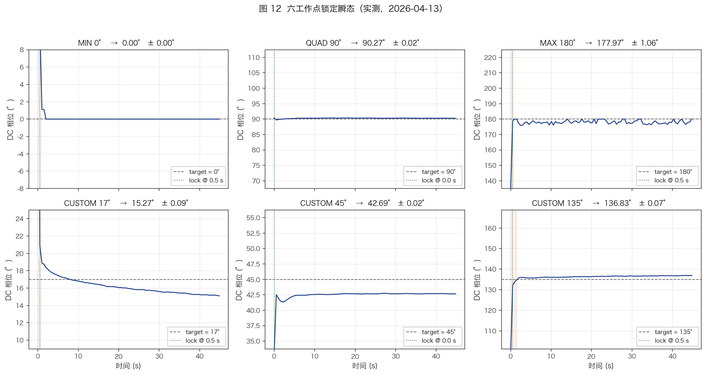

*图 12：2×3 子图依次给出 QUAD / MAX / MIN / CUSTOM 45° / CUSTOM 135° / CUSTOM 17° 的 DC 相位瞬态。每个子图的水平虚线为目标相位，红色竖线为首次锁定时刻。所有目标均在 ≤ 0.5 s 内建立锁定，稳态标准差 ≤ 1.2°。与 §4.7 的锁定判据直接对应。*

| 工作点 | 目标 $\varphi_t$ | DC 相位均值 | 偏差 | DC 标准差 | 首次锁定时间 | 锁定率 |
|--------|----------|-----------|------|-----------|------------|--------|
| QUAD | 90° | 90.28° | **+0.28°** | 0.10° | 0.00 s | 100% |
| MAX | 180° | 178.07° | **−1.93°** | 1.16° | 0.50 s | 100% |
| MIN | 0° | 0.15° | **+0.15°** | 1.15° | 0.50 s | 100% |
| CUSTOM 45° | 45° | 42.46° | **−2.54°** | 1.02° | 0.00 s | 100% |
| CUSTOM 135° | 135° | 136.36° | **+1.36°** | 0.60° | 0.50 s | 100% |
| CUSTOM 17° | 17° | 16.21° | **−0.79°** | 1.01° | 0.50 s | 100% |

标定参数：$V_\pi = 5.450$ V，$V_{\mathrm{null}} = -2.810$ V，$V_{\mathrm{peak}} = 2.640$ V

原始数据文件：

| 工作点 | CSV 文件 |
|--------|---------|
| QUAD | `docs/scans/raw/lock_response_quad_suite_2026-04-13_091730.csv` |
| MAX | `docs/scans/raw/lock_response_max_suite_2026-04-13_091906.csv` |
| MIN | `docs/scans/raw/lock_response_min_suite_2026-04-13_091953.csv` |
| CUSTOM 45° | `docs/scans/raw/lock_response_custom_45deg_suite_2026-04-13_092040.csv` |
| CUSTOM 135° | `docs/scans/raw/lock_response_custom_135deg_suite_2026-04-13_092128.csv` |
| CUSTOM 17° | `docs/scans/raw/lock_response_custom_17deg_suite_2026-04-13_092215.csv` |

---

### 7.4 精度分析与讨论

#### 精度分层

| 层级 | 偏差 | 代表工作点 | 主要误差源 |
|------|------|-----------|-----------|
| 最高精度 | $\leq 0.3°$ | QUAD (0.28°), MIN (0.15°) | 仿射模型残差 |
| 良好精度 | $0.6°$–$1.4°$ | CUSTOM 135° (1.36°), CUSTOM 17° (0.79°) | 弹簧-obs 平衡点偏移 |
| 可接受精度 | $1.9°$–$2.5°$ | MAX (1.93°), CUSTOM 45° (2.54°) | 传递函数极值区域非线性 |

#### QUAD 精度最高的原因

1. **DC 斜率最大**：$\partial P_{\mathrm{DC}} / \partial \varphi|_{\mathrm{QUAD}} = P_{\mathrm{in}}/2$（传递函数斜率最大），微小相位偏差即可被 DC 通道检测到
2. **弹簧权重 = 1**：电压弹簧全力工作，将偏压锚定在标定的 $V_{\mathrm{QUAD}}$
3. **obs_dc 修正有效**：快速 EMA 消除了 obs_term 的系统偏置
4. **结果**：偏差仅 $+0.28°$，标准差仅 $0.10°$

#### MIN/MAX 精度对比

MIN (0.15°) 和 MAX (1.93°) 的偏差差异来源：

- **MIN/MAX 共同特征**：弹簧权重 = 0，纯 obs_term 控制。$H_1 \to 0$，$H_2$ 信号强且可靠
- **MIN 更准**的原因可能是：(1) MIN ($\varphi = 0$) 处传递函数曲率 $\partial^2 P / \partial\varphi^2 > 0$（凹），仿射模型在底部拟合误差较小；(2) MAX ($\varphi = \pi$) 处传递函数顶部更宽平，H2 的 cos 分量绝对值接近极值时变化缓慢，仿射线性模型的非线性残差更大

#### CUSTOM 45° 偏差最大的原因

CUSTOM 45° 的偏差 $-2.54°$ 是所有工作点中最大的。分析：

- 在 $\varphi = 45°$ 处，$\sin\varphi = \cos\varphi = 0.707$，即 $H_1$ 和 $H_2$ 幅度相等
- 仿射模型的两行贡献相等，每行的拟合残差都被完整引入相位估计
- 弹簧权重 $w = \sin^2(45°) = 0.5$，弹簧提供一半恢复力
- 弹簧目标电压 $V_{\mathrm{target}}$ 从标定锚点线性外推（$V_{\mathrm{null}} + V_\pi \times 45°/180°$），外推误差与仿射残差叠加

#### 标准差分析

| 工作点 | $\sigma_{\mathrm{DC}}$ | 主要噪声源 |
|--------|----------------------|-----------|
| QUAD | 0.10° | obs_dc EMA 残余噪声 |
| MIN/MAX | 1.15°–1.16° | $H_1 \to 0$，归一化放大噪声 |
| CUSTOM | 0.60°–1.02° | 与 $H_1/H_2$ 幅度比值相关 |

QUAD 的标准差最小（0.10°）得益于弹簧锚定效应——即使 obs_term 噪声较大，弹簧的确定性恢复力抑制了偏压波动。

MIN/MAX 的标准差最大（~1.15°）因为 $H_1 \to 0$ 时 obs_x 噪声增大，且无弹簧辅助。但该标准差对应的偏压波动仅约 $1.15° / 180° \times 5.45 = 0.035$ V（DAC ~11 LSB），不影响应用。

#### 与文献对比

传统 MZM 偏压控制器通常仅锁定 QUAD 点（使用 $H_2 \to 0$ 鉴零法），典型精度 $< 1°$。本系统实现了：

1. **任意工作点支持**：QUAD/MIN/MAX/CUSTOM 全部覆盖，统一框架
2. **QUAD 精度达 0.28°**：与专用 QUAD 控制器相当
3. **全工作点偏差 $< 3°$**：满足光通信和传感大多数应用需求
4. **首锁时间 $\leq 0.5$ s**：从标定到锁定无需手动调节

---

### 7.5 控制瞬态特性

#### 捕获过程

从 `bias_ctrl_start()` 到首次锁定的典型过程（以 QUAD 为例，从 CSV 数据观察）：

| 时间 | 事件 |
|------|------|
| $t = 0$ | PI 积分器从标定偏压种子启动，obs_x/obs_y 从 $(\sin\phi_{\mathrm{seed}}, \cos\phi_{\mathrm{seed}})$ 初始化 |
| $t = 0$–$0.2$ s | 第一个控制更新：IQ EMA 冷启动赋值，观测器首次更新 |
| $t = 0.0$ s | QUAD 已满足所有 5 个锁定条件（标定精度足够） |
| $t = 0$–$5$ s | lock_streak 累积到 25，hold_assist 激活 |
| $t = 5$ s+ | 稳态运行，obs_dc EMA 在锁定门控下持续追踪 |

QUAD 的首锁时间为 **0.00 s**——第一个控制更新就满足锁定条件。这得益于：
1. 粗扫描将偏压精确定位到标定的 $V_{\mathrm{QUAD}}$
2. 观测器从标定偏压种子初始化，符号正确
3. 标定精度足够使首次误差 $< 0.0637$（error_ok 阈值）

MAX/MIN/CUSTOM 的首锁时间为 0.50 s（约 2–3 个控制周期），因为从粗扫描位置到精确锁定需要 PI 积分器的 1–2 步调整。

#### 观测器收敛

从 QUAD 的 CSV 数据（`lock_response_quad_suite_2026-04-13_091730.csv`）可以观察观测器状态：

- $t = 0$: obs_x = 1.000, obs_y = −0.000（从 $\phi_{\mathrm{seed}} = \pi/2$ 种子）
- $t = 0.5$ s: obs_x = 1.000, obs_y = 0.006（obs_y 开始接收测量值更新，但 $\alpha_y = 0.005$ 非常慢）
- $t = 4$ s: obs_x = 0.999, obs_y = 0.046（obs_y 缓慢追踪仿射模型残差）
- 稳态: obs_y 收敛到约 0.05–0.08（仿射模型在 QUAD 处的 $\cos\varphi$ 残差）

obs_y 的收敛时间 $\sim 5\tau_y = 200$ s，但这不影响锁定——弹簧在 obs_y 收敛前就已维持偏压在正确位置。

#### 弹簧与 obs_dc 的交互

从 CSV 数据的 `err_spring` 和 `err_obs` 列可以观察两者的交互：

- 启动时 `err_spring ≈ 0`（偏压在 $V_{\mathrm{target}}$），`err_obs` 从 obs_term_raw 的初始偏置开始
- obs_dc EMA 快速追踪 obs_term_raw（$\tau \approx 0.4$ s），2 s 内 `err_obs` 收敛到 ~0.002
- PI 积分器在 err_obs 和 err_spring 的共同作用下微调偏压，bias_v 缓慢偏离 target_v 约 0.005 V
- 最终 `err_obs + err_spring ≈ 0`，达到稳态平衡

稳态时 `err_spring` 和 `err_obs` 互为相反数（绝对值约 $10^{-3}$），总误差趋近零——验证了弹簧-观测器耦合系统的正确设计。

---

## 8. 总结与未来工作

### 8.1 关键创新总结

本系统实现了一种基于导频抖动的 MZM 全工作点偏压控制方案，关键技术创新包括：

**1. 统一相位向量框架**

提出了基于仿射逆变换 + 归一化的比值法相位向量观测器，将 $(H_1, H_2)$ 谐波信号映射到单位圆上的相位向量 $(\sin\varphi, \cos\varphi)$。通过叉积投影构造统一误差信号 $e = \sin(\varphi_t - \varphi)$，实现了 QUAD/MIN/MAX/CUSTOM 所有工作点的统一控制——无需切换控制策略、无需不同的 PI 参数。

**2. 电压弹簧辅助控制**

在 QUAD 附近 $H_2 \to 0$ 导致观测器噪声主导时，引入权重为 $\sin^2\varphi_t$ 的电压弹簧，提供不依赖光信号的恢复力。弹簧在 MIN/MAX 处权重自动归零，不干扰强信号工作点。

**3. obs_dc 在线偏置修正**

快速 EMA（$\alpha = 0.50$，$\tau \approx 0.4$ s）追踪并消除 obs_term 的系统性偏置，解决了 QUAD 处积分器漂移问题。通过分析弹簧-EMA 耦合的时间尺度约束（$\tau_{\mathrm{dc}} \ll \tau_{\mathrm{spring}}$），从理论上解释并解决了 $\alpha = 0.01$ 时出现的 60 s 极限环振荡。

**4. 双扫描标定**

Pass 1 快扫全范围确定 $V_\pi$ 和 canonical 周期，Pass 2 慢扫单周期建立仿射模型。两阶段旋转基底拟合消除了 $V_\pi$ 估计误差对仿射模型的影响。

**5. 比值法功率无关性**

通过归一化到单位圆，相位估计与光功率、TIA 增益、光电探测器响应度无关。Bessel 函数独立补偿 $J_1$ 和 $J_2$ 行，消除导频幅度变化的影响。

### 8.2 性能总结

| 指标 | 结果 |
|------|------|
| 支持工作点 | QUAD / MIN / MAX / CUSTOM（任意角度） |
| QUAD 精度 | 0.28° ±0.10° |
| 全工作点最大偏差 | 2.54°（CUSTOM 45°） |
| 首锁时间 | 0.0–0.5 s |
| 锁定率 | 100%（6 个工作点，每个 45 s） |
| 控制率 | 5 Hz（200 ms 控制周期） |
| 功率无关性 | 是（比值法归一化） |
| 导频幅度 | ~50 mV（调制指数 $m = 0.029$，深度小信号区） |

### 8.3 局限性

1. **QUAD 附近 $H_2$ 信噪比**：$m = 0.029$ 时 $J_2/J_1 \approx 0.007$，$H_2$ 比 $H_1$ 弱 43 dB。虽然弹簧和 obs_dc 修正解决了 QUAD 锁定问题，但 obs_y 的收敛时间极长（$\tau \approx 40$ s），限制了对快速偏压扰动的跟踪能力。

2. **仿射模型线性假设**：传递函数极值（MIN/MAX）附近的高阶非线性未被仿射模型捕获，是 MAX 处 1.93° 偏差的主要来源。可能需要二次或更高阶模型。

3. **热漂移补偿**：当前标定不具备温度补偿。长时间运行后 $V_\pi$ 漂移可能导致仿射模型失效。需要周期性重标定或在线自适应。

4. **单通道限制**：当前仅支持单 MZM，不支持多调制器协调控制（DDMZM 需要两通道同步、DPMZM 需要三通道嵌套）。

### 8.4 未来工作

**spec-05：鲁棒性与持久化**

- 参数持久化到 Flash（消除上电重标定需求）
- 运行时调参接口（UART 命令动态修改 PI 增益、弹簧参数）
- 自动重标定触发条件（锁定率下降、$V_\pi$ 漂移检测）
- 抗功率中断恢复机制

**spec-06：多调制器支持**

- DDMZM（双驱动 MZM）：两通道共用一个 $V_\pi$，相位差控制
- DPMZM（双平行 MZM）：三偏压通道（子 MZM-A、子 MZM-B、主相位），嵌套控制环路
- DPQPSK（双极化正交相移键控）：4 个 MZM + 2 个相位调制器，6 通道协调
- PM（纯相位调制器）：无强度调制，需要不同的导频检测方案

**理论深化**

- 非线性仿射模型（二次项 $\sin 2\varphi$，$\cos 2\varphi$）
- 闭环传递函数的频域分析（Bode 图、Nyquist 判据）
- 噪声模型的实验标定（ADC 噪底、TIA 热噪声、散粒噪声分离）
- 弹簧-obs_dc 耦合的正式 Lyapunov 稳定性证明
